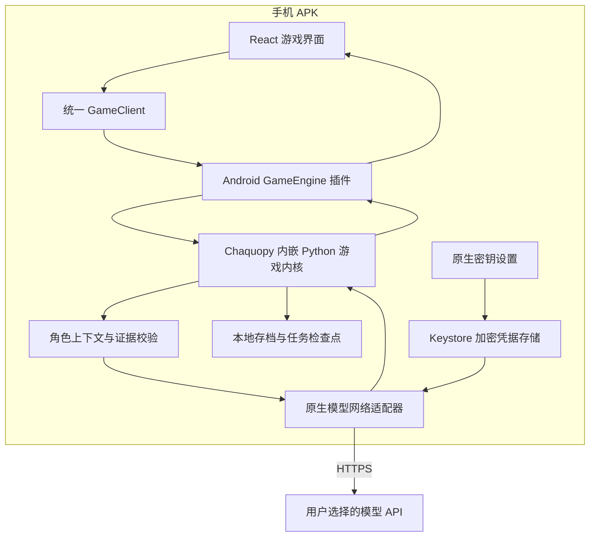

# 安卓独立运行版设计与实施计划

## 2026-10-05：独立剧本内容更新（preview.3）

客户端版本为 1.0.0-preview.3 / versionCode 16，arm64-v8a / minSdk 24。APK 固定保留前三个基础本与18张配图，新增本通过签名 `.mmstory` 安装；目录修订与内容版本独立于 APK。首页精选库增加已下载、发现新本、目录检查、下载进度、取消重试与离线包安装，原生队列与游戏/模型任务分离。

内容包、冻结存档、版本图片、命名空间隔离与发布契约见 [内容更新记录](story-content-updates.md)。content-r1 已上传六个包并从远端逐个核对长度和哈希，实际 Android 验证器的 JVM 验签/解包通过。三个新增文字本标为体验预览，未声称完成真实模型或玩家体验评审。

验证：后端全套336项通过，补充恢复检测后内容服务11项通过；Web 6个测试文件及 lint/类型/构建通过；手机纯Python引擎6项、原生7项、发布工具3项通过。APK递归检查3本、18图及公开信任配置与源码一致，无密钥或电脑用户数据。

手机同签名覆盖安装成功，versionCode核对为16；安装前后游戏数据库、加密模型配置和草稿文件校验值完全一致。未卸载或清除数据，也未执行电脑锁屏。手机解锁后已验收官方目录、花房本在线安装、晚宴本取消与系统文件选择器离线安装；中断测试发现并修复启动互锁，正在执行最终冷启动验收。真机首页无横向溢出。


### Logo 统一与覆盖升级（2026-10-03）

用户选定 A「案卷搜证」Logo；首页、favicon、五种密度的安卓桌面／圆形／自适应图标和启动图同步替换。发布 `v1.0.0-android-preview.2`，应用版本 `1.0.0-preview.2` / versionCode 15；README 下载链接指向新版，旧发布保留回退。图稿与派生资源构建说明见 [Logo 设计](logo-design.md)。

最终 APK SHA-256：`b493e8a47df4a605621f8e8b1482fe89dfeedfc2a71a992b2de2580343ab1623`，26,445,358 bytes。递归检查1,314个条目，3个内置剧本包及18张配图与源码一致；没有本机 API key、.env、电脑数据库、存档或签名私钥。沿用现有开发签名，ADB覆盖安装成功，手机版本核对为15。安装前后手机游戏数据库、加密模型配置和草稿文件SHA-256全部一致，没有清除数据。

验证：Web 5个测试文件、lint、TypeScript/Vite/Gradle构建、包内检查、签名和版本检查通过。手机仍锁屏，尚未完成新图标和首页的真机目测；本次未调用真实模型、推进游戏或执行电脑锁屏。

### 公开下载预览版（2026-10-03）

发布 `v1.0.0-android-preview.1`，应用版本 `1.0.0-preview.1` / versionCode 14。沿用当前开发签名、应用 ID `com.murdermystery.game.debug`，arm64-v8a，minSdk 24。APK 作为 [GitHub Release 附件](https://github.com/Rookiecoder-jsjs/Murder-Mystery-Game/releases/tag/v1.0.0-android-preview.1) 提供，不放入 Git 源码。README 增加下载、手机配置密钥、精选本选择、生成质量提示和构建说明。

本次发布包 SHA-256：`db6fc143df9d22123cfc0de6ee2cbf5670d45f7ef95e7ec3104fb4a8e361cd2d`，25,320,606 bytes（约24.15 MiB）。3个原创精选包和18张配图逐字节与源文件一致；另保留兼容用《子夜当铺血案》。APK 没有预填 API key，没有电脑 `.env`、游戏存档、用户数据库或日志。首次安装由玩家在原生设置自行填写；覆盖安装保留手机已有配置，不能把已有 configured 状态误认为 APK 内置凭据。

构建末尾新增自动检查：`python3 scripts/audit-android-apk.py <APK>`，遍历外层APK及Chaquopy嵌套归档共1,312个条目，检查凭据特征，并在内存中比对本机环境密钥及其UTF-16/base64表示；不打印真实值。三个负面样本（夹带.env、嵌套归档凭据、自定义格式本机凭据）均被拒绝且错误不暴露值。验证：Web 5个测试文件、lint、TypeScript/Android构建、安卓引擎4项模拟回归、apksigner签名验证及aapt版本/ABI检查通过。本次仅调整发布版本与构建检查，没有新增真实模型请求或在手机覆盖安装；真机游戏流程与配图验证沿用下方版本12/13记录。

日期：2026-10-03。版本：13。状态：三个内置本已配齐 3 张场景封面及 15 张角色头像，随 APK 加载，真机显示与更新保留存档通过；安卓版 DashScope 在线生图尚未接通。版本12的三个内置本真实模型流程、同签名覆盖升级和冷启动复盘验证完成；已修正时间证据、时间区间校验、角色修补提示与聊天自动跟随。个别复杂质问仍会降级为证据复述。版本10的阶段切换闪黑、证据选择与同类弹层配色已修复，手机尺寸和桌面模拟复测通过；解锁后真机证据/对象选择、指认弹层、搜证与对质往返及中文键盘通过，追加加深指认身份小字并同签名覆盖安装。版本9的流程优化已覆盖安装，成品开局、基础结案离线及真机三轮通过。剧本内容与角色回答质量仍有局限。

本方案替代此前“手机连接电脑/服务器后端”的方案。用户目标已经明确：**安装 APK，在手机填写自己的模型 API key，即可完整游玩；无需自己的电脑、服务器、Python 环境或额外应用。** 当前实现与构建方法见下文“实施记录”；其余章节保留目标设计，不能视为全部完成。

版本13的配图、资源版本保留规则和后续原生 DashScope 接入见 [内置配图记录](story-artwork.md)。最终 APK SHA-256：`215173ea42e656db1926d4780d778eb8c940f420b180776e651d0984953eaabf`，同签名覆盖安装成功。新增配图不会更改历史快照的案情或角色知识。

版本10的原因、改动和复测见 [安卓 UI 检查](android-ui-audit.md)：移除阶段全屏黑色遮罩，弹层统一纸底深字，证据和询问对象增加明确选中标记，加深浅灰小字及指认卡片身份。阶段规则和模型流程没有改变。版本10 APK SHA-256为 `57567f541bcb51a4c89381d6d906c924e91724805528170827c8add7e053e351`，同签名覆盖安装成功。解锁后核对原8个存档、两局原始草稿、历史、线索和配置状态均保留，无未完成任务；本次没有新增游戏、模型问答或正式投票。

版本9的流程改动及完整验收见 [游玩流程优化记录](gameplay-flow-optimization.md)：审稿仅发生于新制作，成品／旧档开局不审稿、不生成画像；补查留在本轮、下一轮明确推进；玩家确认先保存终局，人物意见可选。默认介绍一键进入调查，证据原文随时阅读，正文／对象／证据草稿可恢复。该版 APK SHA-256 为 `c8ec7dcaa3c8a6c422dbac47c3f859b097078be8076c58795680d401f12a23fc`，已覆盖安装，密钥及原 5 个存档保留。新增《子夜当铺血案》三轮测试局完成，15条证据、13条事件，离线确认至完整基础揭晓约168ms；仅是单局样本。

之前的六项 UI 适配修复见 [安卓 UI 适配检查](android-ui-audit.md)。本轮还修复了恢复任务栏占半屏及中断后标题丢失；真机栏高61dp，冷启动、覆盖更新后继续原任务均通过。其他机型、系统大字体和经典模式完整实玩仍待验证，个别 NPC 仍会退回照读证据。


### 版本12：内置内容真实模型实玩

实玩与修复详情见 [内置剧本验收](builtin-story-playthrough.md)。雨夜v1/v2三轮各9线索、白鹭三轮10线索、雾港经典12线索均完成正式结案，好人胜利；四个测试存档保留。补足雨夜的时间证据并升级内容版本2，角色修补明确分句与旧话来源，加入凶手自保提示；校验支持明确时间范围中的子时点，增加6个回归；修正聊天自动跟随被平滑滚动中间位置打断的问题。复杂质问仍有降级、早期自白与无关细节风险，不能宣称人物质量全部通过。

后端最终315项、安卓引擎4项、Web5个测试文件及lint/类型/构建通过。最终APK为 `32bdeccc72e1b62d513af732d0f00196f2654ff55b0290fee0dcb4e28609f07b`，已同签名覆盖安装并核对手机校验值。冷启动后原8个存档公开摘要不变，本轮4局及全部证据、历史、复盘保留，密钥configured状态保留，无未完成任务。首页待游玩；用户已取消“完成后锁屏”，本轮未执行电脑锁屏。内置远程下载、文件选择器实际导入等仍未验证。

### 版本11：原创剧本库与动态角色

首页优先精选，新增三个原创数据包（3、5、7角色），生成入口支持自动或指定3—8人并明确质量提示；Web、小程序与安卓本地引擎同步契约。剧本包有版本、来源和公开元数据；JSON导入执行本地结构与可达性检查，幂等重试并只接受更高版本的不同内容。内置更新随APK发布，远程自动下载暂未实现。快照schema_version=4嵌入完整正文，旧游戏重启后保留自己的版本。详见[剧本库说明](story-library.md)。

验证：后端309项全套通过；最终小修后相关67项通过。三个剧本覆盖24个角色/模式完整流程组合；安卓纯Python4项、Web5个测试文件、小程序1个测试文件通过；两端类型检查、Web lint与构建、小程序构建、安卓同签名APK构建通过。320/360像素只读浏览器预览没有横向溢出，按钮与人数选择高度44px。真实模型人物质量与微信文件选择器尚未实测。

最终 APK SHA-256：`78cc794997b3533a166e47cabad1c67f52fc2b39f01a2949e2a35cbf83a9d91c`。先构建的 `ef880a89…` 已被真机适配修正版替代。核对APK内四个catalog资产齐全，Python目录服务、会话服务和mobile_runtime与最终源码逐字一致，不含.env、用户sessions或签名密钥。2026-10-03 用户解锁后完成同签名覆盖安装，手机已安装 APK 校验值与最终构建一致。原8局公开存档摘要（ID、阶段、轮次、最后活动时间）、4个个人剧本和 configured=true 均保留，任务列表为空；没有新增手机游戏、导入内容或请求真实模型。

真机为 Redmi 2311DRK48C，Android16，CSS视口约406×904。精选页显示3/5/7人原创本；我的剧本显示原4本；生成页自动和3—8人选择、质量与费用提示可见，8人选择后恢复自动，选择框高44px，无横向溢出。滚动截图发现首页正文穿过状态栏：原先整个document滚动会带走root的安全区留白。改为固定原生根容器、首页自身滚动后，document scrollY=0，首页范围y=40—888（848px），状态栏与手势区不再覆盖正文。修正后lint、类型检查和APK构建通过。打开原第1轮讨论存档只读复测，游戏同样在y=40—888；输入法弹出视口约406×556时消息区高263px、输入框与发送按钮底部约546px，均可见，返回依次收键盘、回首页。未改正文、对象和证据选择，没有推进或投票。新原创本真实模型完整实玩及Android/微信文件选择器实际导入尚未验证。

### 用户现成剧本核验诊断（2026-10-03）

以下为版本8的诊断记录。版本9已移除这条开局审稿路径，缓存命中与审稿版本变化均不再决定成品能否开局；旧稿内容没有因此自动修订。

用户报告现成剧本长时间显示“正在核验剧本并开局”，结束后仍留首页。只读检查手机任务、回执及代码，确认《糖衣砒霜》在 00:44:48、00:51:01、00:52:02 发起三次 `/games/load`：前两次状态为 failed、422，没有创建会话；第三次 done，创建会话 `7b8c9fa8-9246-473b-b176-27d7d786a921`，检查时手机已显示该局序幕，玩家苏曼丽。

每次均执行初审和负面意见复核两次模型请求，耗时分别合计 96.706 秒、43.261 秒、59.191 秒。慢的是远程模型审稿，不是读取 JSON 或页面跳转。首次按当前版本检查没有成功缓存的旧剧本必须审稿；失败不缓存，重新点击产生新的任务和请求，因此重复等待。

三个初审均发现同一电话方向矛盾，前两次复核也拒绝，第三次复核却放行。旧稿内容没有被修补，第三次通过不能作为内容质量合格证明。该矛盾此前人工实玩已经确认，故这是审稿复核漏检及判定波动，不应通过重复点击来获得放行。成功审稿仍会留下可复用缓存，后续修复需考虑撤销这个失败样本的错误正面检查；本轮诊断没有改缓存、存档或用户当前游戏。

反馈也存在遗漏：现成剧本只有静态核验提示，未报告实际审稿/复核阶段；错误显示在上方“今夜新剧”区域及任务列表，用户在下方“保留剧目”处不易看到。失败时留首页是未创建会话的正常分支，但当前界面没有清楚说明原因。本轮仅诊断，未改实现、未新增模型请求或重新安装 APK。

## 实施记录（2026-10-02）

已实现的开发版本：

- React 通过 Capacitor 8 的 `GameEngine` 插件调用进程内 Python；APK 不设远程 `server.url`，不启动 FastAPI/Uvicorn，不需要 ADB reverse。
- 原生插件使用 Java 21（沿用 Capacitor 模板），网络使用 Android `HttpsURLConnection`；密钥由 Android Keystore 的 AES-GCM 密钥加密。设置界面由原生控件输入密码，WebView/Python 不读取密钥。
- Python 3.11 由 Chaquopy 17 打包。共享核心暂保留在 `backend/app`，由 `scripts/stage-android-python.py` 按 22 个源码文件的白名单复制到生成目录；不维护第二份游戏逻辑。环境文件、电脑存档和日志不会进入 APK。
- `mobile_engine/` 提供 SQLite 存档、串行任务调度与原生模型适配。每个动作有稳定 ID；模型结果持久化复用；中断任务须手动继续。讨论保存每个角色的冻结上下文与已完成回复，恢复时不重新提问或重复记账。
- 内置一份“子夜当铺血案”；新开局仍需在线审查。首页可续局、继续中断任务和修改模型设置；Android 原生私有存储保存发言草稿。
- 手机固定竖屏，首页单列、资料抽屉、44px 触控目标、安全区与软键盘布局。回到前台刷新状态；同一页面轮询串行执行。Android 构建去除外部字体链接，使用系统字体。

已完成验证：主机 245 项后端测试、7 项前端状态/SSE/原生分发测试（Node 22），前端 lint、Android 构建通过；无第三方 Python 依赖的模拟模型三轮全流程与中断/重启恢复测试通过。Redmi 2311DRK48C（Android 16）安装和冷启动，内置 Python 3.11.14 规则/SQLite 探针通过。手机已填写用户授权的环境密钥，真实模型认证与请求成功，覆盖升级保留配置。

### 本轮真机实玩记录

在手机正常界面完成修订版《子夜当铺血案》：玩家沈默，速推三轮，15 条线索全部可见；第一轮全员讨论，第二轮向林四出示茶杯证据，第三轮向钱伯安出示鞋印证据；最终投票钱伯安并结案，`winner=good`。NPC 表决正常记录，未用于覆盖玩家的最终选择。会话 `d69976eb-3050-4b5b-aaa9-27bd50df9198` 有 14 条唯一事件，三次玩家问题各保存一次，无未完成讨论。真实对话和表决共 26 次模型调用（包括审查与重试），供应商回执累计输入 97,962 tokens、缓存命中 28,928 tokens，按输入量加权命中率 29.53%；不包含剧本生成/审稿，不把本地重放算作供应商命中。

- 验证了角色剧本阅读、线索详情弹窗及系统返回、键盘弹起后输入/发送、三轮调查门槛、定向提问、出示证据、正式投票和揭晓。
- 第一轮未发送草稿经杀进程后恢复；第二轮存档在覆盖升级后继续；第二轮发言切后台后从首页显式继续，原问题未重复保存。此次切后台发生在模型调用前，不能据此声称已验证真实网络请求途中断网或断电；这些异常目前只有模拟测试覆盖。
- 结案后再次杀进程并冷启动，首页显示“复盘”，打开后胜负、15 条线索及 14 条事件不变，模型调用数仍为 26，未为复盘重新计费。
- 本轮 ADB 发言使用英文问题，模型回复中文；中文输入法组词、跨机型布局、经典模式完整实玩、弱网与系统低内存回收尚未完成真机验收。不能据此宣布 P3–P5 全部完成。

实玩发现并修改：生成重试原先只有错误提示、没有原稿，现携带原始 JSON 修复；角色缺失字段报错包含角色 ID 与字段名；初审误判增加独立请求复核，结构错误和复核确认的语义错误仍拒绝。内置案件补齐证据原文及勒索、足迹限定，正常模型审稿通过后才进入游戏。手机原有内置文件仅在确认无任何游戏存档、无运行任务时同步修订；未修改任务审稿结果或伪造成功存档。竖屏阶段条及轮次被挤出屏幕的问题已修复，介绍人物卡与聊天头像已缩小，修复版已在本局中覆盖安装并续玩验证。

仍未通过的项目：本轮“都市公寓中的毒杀”真实生成经重试仍有结论引用错误、关键服药规律缺证，拒绝开局；最终审稿复核变更后没有再发起新剧本生成，不能宣称生成可靠性已解决。角色发言检查能拦截新增鞋子年份、事后行动等编造，但也观察到未知表达/分句被误判、修复失败后回答偏题或重复固定说辞，仍需改进相关性与校验准确性。

### 生成与对话校验修复（续）

上述未通过项已继续修复：

- 生成提示减少不必要的隐藏身份和多重反转，要求先确定时间线、调查证据，再写结论；修正 JSON 示例中多余的双层花括号。
- 结构问题与语义问题各最多两次修补，互不消耗额度。修补按角色/线索稳定 ID 定位单个字段，原子应用，禁止删除角色或变更角色/线索 ID；开局前允许纠正填错的真凶字段，随后必须重新核对实际致死者和本人作案原文；每次重新检查结构和证据闭环，不保存半成品。最多两次初始生成调用（无可解析 JSON 或调用失败才用第二次），随后最多四次修补；独立审稿/复核另计。中断异常仍交给手机恢复流程，不能变成自动付费重试。
- 精确引用错误给出 solution 与 evidence 的具体位置、线索 ID 和原引用。复核反馈保留更多具体问题，避免只修前几个缺证项。
- 发言检查保留全部分句，同时提供其完整句子，正确区分纯粹未知与独立的行动断言；事实和未知在生成及修复提示中明确分开。出示证据后的兜底保留证据归因，不再用无关秘密或固定掩饰代替解释。
- 真实模型定点验证：“是谁下的药，我不知道”通过；“我没离开客座，我不知道谁下药”有本人依据可通过；无依据的“我退到门口，我不知道谁下药”仍拒绝。林四实际回答围绕茶杯、客座与此前掩饰，没有转去讲密信。
- 第一轮新案件实测发现模型把线索编号误当数组下标，补丁被拒绝；因此进一步改为 `/clues/clue_15/content` 等稳定 ID 路径，并新增乱序列表与数字下标拒绝测试。此失败任务已通过首页移除提示，原存档与诊断记录保留。

- 第二轮《锡灰公寓毒杀案》虽曾被旧审稿复核放行，但人工读取最终稿发现指定凶手 `char_1` 与结局实际致死者 `char_4` 不同，故不计作通过。未通过游玩验收的测试会话 `caf9020e-6a74-4a90-b2de-567e488665c2` 保留作失败样本，不应续玩；没有改写该会话真相或伪造验证结果。
- 据此取消新剧本“负面初审→笼统复核放行”的路径：负面意见必须修稿。新旧剧本的正面审查均须输出从真相独立识别的致死者 ID 和该角色本人致命作案知识原文，后端核对身份及原文归属；审稿缓存升级为 v4。已开始的游戏不自动换真凶。生成顺序改为先统一真凶与真相，再写角色和证据，减少前后换人。
- 上一轮代码的 262 项后端回归、无第三方依赖的 APK 引擎三轮/恢复测试通过；主要修复版已覆盖安装，CodeGraph 已同步，无客户端接口变更。当时追加的证据原文规范化与 JSON Output 已构建，但手机锁屏、旧任务尚待恢复，尚未覆盖到手机；现已安装，结果见下节。

- 后续实测还发现相同修补请求会命中手机的调用重放，重复拿到无效补丁。修补提示增加阶段与尝试序号：同次任务的下一次修补是新请求，恢复同一次尝试仍可复用已完成调用。
- 剧本任务此前强制关闭思考，不能很好完成跨字段证据推理。现仅对官方 DeepSeek V4 端点启用 `low` 思考强度，单次超时最多 300 秒、不自动网络重试；普通角色聊天与其他供应商行为保持原有设置。该参数依据 [DeepSeek 官方思考模式文档](https://api-docs.deepseek.com/guides/thinking_mode/)；具体质量与耗时仍以真机样本为准。

- 为新稿规范化证据引用：模型选择 `clue_id`，程序填入对应线索的完整真实原文；错误 ID 不改猜，是否支持结论仍由语义审查验证。已有存档不自动修改。官方 DeepSeek V4 剧本请求同时启用 [JSON Output](https://api-docs.deepseek.com/guides/json_mode/)，避免返回少一个括号的补丁。
- 《上三楼公寓毒杀案》已在手机完成原稿与部分修补，模型返回中确认启用了思考。任务 `4b31751a-ae8f-4585-8830-743372a17234` 在最终审稿请求出现连接中断/超时，仍是 `interrupted`，未建立可玩会话，不计作生成验收通过。手机随后检测为安全锁屏，已请用户解锁；不能据此声称本轮新剧本生成及完整游玩已经验证通过。

旧失败存档的外发重放，以及额外内置角色的真实模型复测被自动审批拒绝，未绕过执行；该限制不影响本地构造样本回归和正常界面新建案件测试。真实模型是概率系统，单次通过不能证明所有主题稳定。

### 最新 APK 真机验收（续）

用户要求“开始真机验证”后，在同一 Redmi 真机覆盖安装最新 APK，SHA-256 为 `9d8024bbe0c06f8e4def1796c027810d8302b629bfb1d5ed8e5d0862fcf3a3fb`，密钥与已有游戏保留。先恢复旧《上三楼公寓毒杀案》任务：已完成调用复用，最终审稿仍发现背景泄密、错误引用和排除依据缺失，任务转为失败，未开局；通过首页移除失败提示，记录保留。

随后通过正常界面新建主题“都市公寓中的毒杀”，生成《糖衣砒霜》。任务与会话 ID 为 `9d276802-e137-42d1-8a3e-d1a8463e024d`，剧本 ID 为 `0a6469a7-ad88-43c5-83c1-9d26e6849e5d`。原稿、初审、字段修补、再审共四份完成回执，耗时约 5 分 9 秒；初审拦截了毒糖已被食用却仍在糖罐中、排除其他嫌疑人的证据不足，修补后再审通过。所有 solution 引用均由程序填为对应线索的完整真实原文，没有靠修改已开局存档通过验收。

本局流程验证完成：

- 玩家赵四爷，速推三轮，按前置依赖依次调查全部 12 条线索。每轮调查与发言门槛正确，第三轮发言前不能投票。第一轮全员讨论并出示咖啡杯，第二轮向林婉珍出示女佣证词，第三轮出示电话记录。最终投票林婉珍，`winner=good`，NPC 意见正常保存；12 条事件 ID 唯一（4 条介绍、3 条问题、5 条回复），没有未完成讨论。
- 通过手机原有中文九宫格输入法组词、选择候选，输入并发送“谁下毒”。键盘弹起时输入、对象、证据、发送区均可见；系统返回先收起键盘，草稿保留。后两轮长问题使用 ADB 英文输入，中文测试仅覆盖上述短句；未覆盖不同输入法、超长中文草稿和跨机型布局。
- 第二轮发送后，确认原生真实模型请求已标为 sent、尚无结果，主动结束游戏进程。冷启动把任务标为 interrupted，首轮记录及第二轮问题保留，请求记录数仍为 90，没有自动重发。首页显式继续后同一任务 attempt=2 完成，第二轮问题与回复各保存一次。该次未确认请求可能已在供应商计费，不能声称重试保证不重复收费；未测试已有部分角色完成的真实并发断流、系统低内存回收或弱网断网。
- 结案后暂时关闭 Wi-Fi（移动数据原本关闭），再次结束进程并冷启动。离线首页显示“复盘”，打开后好人胜利、12 条线索和 12 条事件不变，请求记录仍为 101，无额外模型调用。ADB reverse 列表为空。Wi-Fi 与测试期间 USB 保持亮屏设置均恢复原值；未拔掉 USB 或换另一台手机测试。
- 本局 24 份角色/审查/表决完成回执累计输入 84,901 tokens、实际缓存命中 31,872 tokens，加权命中率 37.54%；另四份生成/审稿回执输入 21,497 tokens、缓存命中 0。中断时未确认的首次请求没有 usage，未计入这些统计；本地重放也不算供应商缓存命中。不同案件和调用分布不可据此直接作性能提升比较。

**流程贯通不等于内容质量合格。** 本局仍发现以下问题，尚未修复：

1. 机器审稿漏检跨字段冲突：电话线索记载公馆向外拨打，结局却记载公用电话打入；公开背景的晚间聚会名单与苏曼丽实际未到场的角色行程也未协调。修补后部分 solution 仍把“厚糖衣延迟溶解”等缺少充分线索支持的细节写成定论，精确原文引用本身不能证明推理成立。
2. 第二轮角色回答在生成、修补与分句核验后降级为照读整段女佣证词，再说“其余细节我无法确认”，没有解释她本人接触糖罐的原因。来源类别及分句提交仍影响回答可用性。
3. 第三轮同一回答先说“所以是我往外拨的电话”，随后又说“那通电话是谁打的……说不清楚”，自相矛盾仍被接受。当前来源核验不能证明发言自身一致，角色对旧说辞的更正也仍需严格核对实际对话历史。

因此本次证明最新 APK 的真实生成、完整速推、请求中断恢复和离线复盘能贯通；不能宣布自动生成审稿、对话质量或 P4/P5 全部通过。测试存档保留用于复现，没有自动改写或删除。此次仅更新验收记录，未修改业务代码，未重复运行上一轮已通过的源码测试。

### 生成性能与手机界面修订（真机续验）

上一局生成的四次模型调用为原稿 140.134 秒、审稿 71.946 秒、修补 72.503 秒、再审 24.358 秒，合计 308.941 秒。主要等待发生在模型推理与输出，不是界面适配或手机 Python 运算。

本轮最终实现：

- 官方 DeepSeek V4 原稿与审稿保留低强度思考；字段修补关闭额外思考并使用短 JSON 补丁。审稿预算为 12,288 tokens（含推理），修补为 8,192 tokens，原稿仍为 24,576 tokens。写作篇幅精炼但不截断必要事实。审稿/修补输入中与同 ID 线索完全相同的全文引用去重，全部原始线索、部分引用及其他字段保留；存档不修改。负面审稿必须修稿，身份与本人致命作案原文核验保留，审稿缓存 v5。电话方向、消耗数量、出席情况和生效机制加入明确核对项。
- 先尝试关闭审稿思考：《暗房密室谋杀案》审稿将“不构成矛盾”的说明列入错误，补丁未解决问题，任务失败而未创建游戏。已撤回非思考审稿策略；失败任务 `e15cb266-57ea-45e4-a8b0-d4207961cbb7` 通过首页收起提示，调用记录保留，不计作性能或质量通过。
- 手机保存实际撰写、结构检查、审稿、修补、保存阶段；轮询只在阶段变化时通知 UI，不新增模型请求，不返回模型设置或主题正文。修复讨论结束后首页任务状态未刷新的遗漏。
- NPC 纯英文、内部编号、未解码标记在发布前拒绝并进入原有修复路径；中文中的外国人名允许。上一轮英文问题是 ADB 测试输入，历史不自动翻译。玩家询问/出示证据元信息显示为中文标签，编号保留在原始事件用于权限和恢复。
- 公开 DTO 增加可选兼容的 `title`（线索调查名称），只随可见线索返回；Web、小程序类型与 HTTP schema 同步。旧档名称为空时从已有内容取摘要，不另行请求模型。
- 手机首页压缩报头与最近存档；搜证短卡片与底部并排操作栏；讨论对象/证据改成底部选择面板，标签保持单行，附可编辑中文提问建议；投票采用紧凑横向人物卡，弹窗适配底部安全区。

最终生成策略在手机通过正常界面新建《霞飞公寓毒冰案》，会话 `0a317a04-2cfb-4368-9565-fb0924bea433`，剧本 `bcb8d262-670e-4f9b-918e-07ac81a22e11`。原稿 146.257 秒，修复线索循环依赖 1.176 秒，思考审稿 42.461 秒，三次调用合计 189.894 秒（约3分10秒），相较上一局约5分9秒减少约39%。原稿反而稍慢；这是不同案件的单局样本，不代表平均值或保证每局加速39%。UI 的阶段名称与实际任务一致。

真机验证：

- 玩家赵大海；三轮全部使用中文提问建议，第一轮全员出示现场物证，第二轮向吴淑珍出示卧室砒霜，第三轮出示毒冰。12 条线索全部可见，12 条唯一事件，无未完成讨论；最终选择吴淑珍，`winner=good`。
- 角色/证据底部面板可选、可滚动；系统返回关闭面板。中文键盘弹出时输入与发送在可见区域，返回收键盘保留草稿，键盘展开时可直接发送。本轮没有重新键入拼音组词，仅使用建议填入中文并验证编辑控件；上一轮的实际中文组词记录仍保留。
- 真机截图确认投票三名候选人与提交按钮同屏；搜证按钮由继承的纵排改成一行。两次局中覆盖升级后继续，第三轮回首页后通过任务入口恢复，没有重复问题或回复。
- 最终 APK 覆盖安装及冷启动复盘，胜负、12条线索与12条事件不变，模型调用记录仍为132，无新增付费请求。原密钥与4个游戏存档保留，测试亮屏设置恢复。没有重复测断网、跨机型、大字体或经典模式全流程。
- 本局三份生成回执输入11,262 tokens，缓存384 tokens，输出17,169 tokens；24份角色/审查/表决回执输入81,168 tokens，缓存35,840 tokens，加权命中44.16%，输出9,245 tokens。不同调用分布不应直接比较缓存性能。

内容质量仍未通过完整验收：结局引用“药房伙计证实买过灭鼠药”，可调查线索中没有这条证言；对其他人的夜间不在场证明也不足以排除午后预置毒冰。第一轮陈国栋声称“从没去过公寓”缺少本人资料依据；部分回答仍兜底为整段照读线索。此局仅证明生成与手机流程贯通、编码/英文呈现及竖屏操作已改善，不证明模型审稿完全可靠。既有测试存档没有自动改写或删除。

验证：后端271项、前端12项行为测试、lint/TypeScript/Android构建、手机引擎3项恢复/进度测试，以及小程序类型检查和状态测试通过；CodeGraph已同步。最终 APK SHA-256：`bab03f2c57ca700c32ae59ac80892dd4714e4fd332b291307c78be80f9c23511`。

当前构建支持 arm64-v8a，minSdk 24；本次只验证了 Android 16 真机。尚未交付正式发行签名、32 位 ABI、画像服务与商店发布配置。开发 APK 的应用 ID 是 `com.murdermystery.game.debug`，卸载会删除本地数据。

构建需要 Node.js 22+、JDK 21、Android SDK 36、Python 3.11（用于构建检查），并配置 `ANDROID_HOME` / `JAVA_HOME`。首次构建需下载 Gradle/Android/Chaquopy 依赖：

```bash
cd frontend && npm ci && cd ..
export ANDROID_USER_HOME=/home/bro/.config/.android  # 当前维护者的既有开发签名目录；其他开发者配置自己的路径
npm run android:apk
# 产物：frontend/android/app/build/outputs/apk/debug/app-debug.apk
adb install -r frontend/android/app/build/outputs/apk/debug/app-debug.apk
```

覆盖更新还必须沿用首次安装时的开发签名。当前测试手机对应 `ANDROID_USER_HOME=/home/bro/.config/.android`，其中已有 `debug.keystore`；未设置该路径时，另一份新开发签名可能在 `~/.android` 自动创建，导致 `INSTALL_FAILED_UPDATE_INCOMPATIBLE`。构建前用 `./gradlew :app:signingReport` 核对，不通过卸载来修复，也不把签名私钥提交到仓库。开发签名与原生API key加密密钥是两回事。

无模型费用的内置引擎回归：

```bash
python3 scripts/stage-android-python.py
PYTHONPATH=frontend/android/app/build/generated/python python3 -S -m unittest discover -s mobile_engine/tests -v
cd frontend/android
./gradlew :app:assembleDebugAndroidTest
adb install -r -t app/build/outputs/apk/androidTest/debug/app-debug-androidTest.apk
adb shell am instrument -w -e class com.murdermystery.game.NativeEngineTest com.murdermystery.game.debug.test/androidx.test.runner.AndroidJUnitRunner
```

测试组件安装需要手机系统允许。不要在已有重要存档的手机直接使用 Gradle connected 测试任务：其自动清理可能卸载游戏。上面的手动安装方法保留游戏。真实密钥通过原生设置界面填写，不得放入测试源码、命令行参数、构建资源或测试报告。

## 1. 产品形态

APK 同时包含现有 React 界面、Python 游戏引擎和 Android 原生适配层。原后端的游戏规则、剧本处理、角色上下文、模型调用编排及存档能力迁入手机；模型推理仍由用户选择的在线供应商提供。

| 能力 | 最终运行位置 |
| --- | --- |
| 界面、角色剧本、线索板、输入和导航 | 手机内置 React 页面 |
| 游戏状态机、搜证、轮次、投票、胜负与揭晓 | 手机 Python 引擎 |
| 剧本生成/校验、逐句证据检查、角色记忆与上下文装配 | 手机 Python 引擎 |
| 模型参数、调用编排、缓存统计 | 手机引擎与原生网络层 |
| API key 加密保存、HTTPS 请求、文件选择和系统适配 | Android 原生层 |
| 剧本、历史、游戏进度、任务记录和头像 | 手机应用私有存储 |
| 大模型推理、可选的 AI 画像生成 | 用户配置的模型服务 |

手机冷启动、查看已有剧本资料/线索/历史和读取存档不依赖网络。需要模型的生成、质问和回复须联网；首版离线模式以阅读和保存草稿为主，不新增一套离线游戏规则。

ADB 只用于开发期间安装、调试和采集本应用诊断。交付验收不依赖 USB 转发、电脑 FastAPI、Vite 或自建 HTTPS 服务。

## 2. 技术路线与选择依据

优先采用 **Capacitor 8 + 自定义 Android 原生插件 + Chaquopy 内嵌 Python + 共享 Python 游戏内核**。选择依据是现有规则、剧本校验与角色上下文已经积累了实现和回归测试，复用能降低迁移时再次引入游戏漏洞的风险。



| 路线 | 主要成本与局限 | 结论 |
| --- | --- | --- |
| 内嵌 Python、复用核心逻辑 | 需要抽离服务端依赖，增加原生桥接、运行时体积和生命周期管理 | 优先验证并采用 |
| 全部重写 TypeScript/Kotlin | 需要重做复杂校验、上下文和测试；容易产生两套规则实现 | Python 路线验证失败时再评估 |
| 手机内启动 FastAPI/Uvicorn | 能复用 HTTP，但增加端口、服务启停、鉴权和恢复管理 | 正式架构不采用 |
| 手机依赖 Termux 或电脑服务 | 安装后还需另装运行环境或维护服务 | 不满足产品目标 |

Chaquopy 官方支持嵌入 Android，并提供 arm64-v8a；当前 17.0 文档列出 AGP 7.3–9.2、minSdk 24+，可选择 Python 3.11。它与计划中的 Capacitor 8 构建基线存在兼容范围，但**文档兼容不等于本项目已打包成功**。[Chaquopy Android 集成](https://chaquo.com/chaquopy/doc/current/android.html)

实施首步必须做技术验证：在已连接手机上启动内嵌 Python，加载当前核心模块，执行一段真实游戏规则，调用原生网络适配器的测试响应，写入并恢复存档，确认无主线程阻塞。通过后再展开完整迁移；若遇到不可接受的依赖、体积或启动性能问题，先给出测量结果再调整路线。

## 3. 当前代码中需要抽离的边界

已通过 CodeGraph 和源码核对，现有后端并非可以原封不动复制到手机。

| 当前代码 | 已发现的耦合 | 迁移设计 |
| --- | --- | --- |
| `backend/app/domain/` | 主要使用 dataclass、枚举和标准库 | 提取为共享内核，保留规则和数据语义 |
| `context_service.py`、`roleplay_protocol.py`、`prompts.py` | 上下文、来源核验、提示词 | 复用现有实现和序列化顺序 |
| `session_service.py` | 引入 FastAPI HTTPException、OpenAI 类型；使用 asyncio 与后台任务 | 通用业务异常、模型接口注入和可恢复任务；Web 层映射 HTTP 错误 |
| `story_service.py` | 全局配置、直接创建 SDK 客户端、按源码目录存文件、守护线程生成头像 | 注入配置、模型网关、存储路径和任务调度器 |
| `core/config.py` | 导入时加载 `.env`，全局单例配置 | 核心只接受显式配置；Web 由 env 适配，Android 由配置档案适配 |
| `image_service.py` | 本地源码路径、urllib、服务端头像 URL | 共用画像提示词，网络和文件存储通过平台端口实现 |
| `llm_trace.py` | 默认落盘完整调用正文与服务端目录 | 移动端默认只记脱敏元数据和 usage；路径显式传入 |
| `frontend/src/api/client.ts` | HTTP/SSE 直接连接 `/games`、`/stories` | 引入统一接口，Web 使用 HTTP，Android 使用插件 |
| `Avatar.tsx` | 依赖后端图片路径 | Android 接收受控的本地资源地址或资源 ID |

手机不整体安装 `backend/requirements.txt`。FastAPI、Uvicorn、服务端入口、dotenv 和桌面测试工具不进入 APK。避免把完整 OpenAI Python SDK 及其原生依赖作为迁移前提，模型请求改由原生适配器执行，核心使用窄接口与明确的数据类型。

### 3.1 共用代码组织

拟新增 `engine/mystery_engine/`，作为唯一的 Python 游戏内核，涵盖 domain、上下文、协议校验、游戏会话、故事编排和抽象端口。后端和 APK 构建都引用这一份源码，不各自维护复制品。

现有 `backend/app/` 保留 FastAPI 入口、HTTP schemas、env 配置、服务端 SDK/文件适配器。迁移时可保留临时兼容导出，让现有导入路径和测试逐步过渡。核心不导入 FastAPI、Android 或具体 SDK；旧存档格式提供兼容读取与版本迁移。

移动构建使用显式文件白名单，只打包共享内核、移动适配代码和选定内置剧本。不得把整个 backend 目录作为资源输入，避免夹带 `.env`、日志、个人游戏存档或真实密钥。

## 4. 模型配置与“一把 key 开始玩”

首次启动显示本地欢迎页，随后配置模型：

1. 选择内置供应商预设，输入 API key，执行明确标注的最小连接/能力测试。
2. 保存成功后进入本地剧本库，可选择内置案件或输入主题生成新案件。
3. 默认让故事生成、角色回复和语义审稿共用这一份供应商凭据，模型可以不同；高级设置才展示分别配置入口。
4. AI 肖像是可选功能。未配置画像供应商时使用首字母头像，不阻止开局，也不要求第二把 key。

连接测试覆盖当前引擎需要的文本响应、工具调用/结构化结果及响应字段。仅返回 HTTP 200 不能代表供应商支持整个游戏流程。“OpenAI 兼容”也不代表任意模型都能直接替换；首版先验证当前项目采用的供应商与模型组合，自定义服务显示能力检测结果。

配置档案包含供应商 origin/base URL、模型名称、角色与审稿模型、超时、上下文预算、生成参数、协议能力及 credentialId。自定义地址允许受支持的 API 路径前缀，统一规范化后再构造端点，保留 HTTPS 验证。凭据绑定供应商，跨 origin 重定向不携带 Authorization。

### 4.1 密钥保存

密钥输入使用原生设置页或原生输入对话框；React 只接收 credentialId、掩码和“已配置”状态。由 Android Keystore 生成 AES-GCM 加密密钥，API key 密文保存在应用私有目录；调用时由原生网络层解密并添加认证头。

Keystore 管理的是加密用密钥，并不是任意 API key 字符串的数据库。模型密钥不放入 Preferences、localStorage、构建变量、Python 全局环境、游戏存档或诊断导出。排除凭据文件的系统备份/设备迁移；恢复到没有对应 Keystore 密钥的设备时要求重新填写。[Android Keystore](https://developer.android.com/privacy-and-security/keystore)

现有电脑 `.env` 仍服务于 Web/小程序部署，不自动复制到 APK 或手机。无需为了安卓发布在代码中写入开发者自己的 key。

### 4.2 网络与模型响应适配

定义 `ModelGateway`，输入为结构化的模型请求，输出为 `CompletionResult`：文本、工具调用、结束原因、usage、供应商请求 ID 和可选推理字段。共享引擎不依赖 SDK 的 `choices` 对象结构。

Web 适配器使用既有 Python SDK；Android 适配器使用原生 HTTPS 客户端（当前使用 HttpsURLConnection），绕开浏览器跨域约束。JSON/tool calling、模型专属参数、超时、429、认证失败、取消与流读取统一映射为业务可识别错误。原生网络层只由受控引擎命令驱动，不向 JS 暴露可携带凭据的任意 HTTP 代理。

当前角色回复经过结构化提交与逐句核验后才正式展示，这一规则保留。供应商流式草稿不得直接进入讨论历史；原生引擎事件推送的是已接受的角色消息、任务进度与完成状态。故事生成可以显示真实阶段，不暴露内部推理正文，也不编造进度百分比。

生成/审稿请求的供应商自动重试策略必须明确且有上限。对“请求已发送但结果未知”的情况，不进行无提示自动重发。

## 5. React 与本地引擎的契约

`GameClient` 是 UI 的唯一游戏入口。`HttpGameClient` 保留 Web 现有协议；`NativeGameClient` 调用自定义 Capacitor 插件，实现等价能力。[Capacitor Android 插件](https://capacitorjs.com/docs/plugins/android)

| 插件能力（拟定） | 行为 |
| --- | --- |
| `initialize` / `getCapabilities` | 初始化本地引擎，返回版本和可用能力 |
| `listStories` / `listGames` | 读取手机存档库与可继续的游戏 |
| `createGame` / `loadStory` | 提交本地任务，立即返回 taskId |
| `getSnapshot` | 返回同一 revision 的玩家可见状态、线索、历史和任务状态 |
| `dispatchAction` | 受控枚举动作：介绍、调查、发言、推进、投票、指认 |
| `getTask` / `continueTask` | 查询任务；用户明确继续中断任务 |
| `engineEvent` | 通知进度、已接受消息、revision 变化和失败 |
| `openModelSettings` | 打开原生设置，回传不含密钥的配置摘要 |

命令带 `requestId`，游戏动作另带 `gameId` 和必要的预期 revision。事件带 `taskId`、`gameId`、`eventSeq`、`revision`；原始模型上下文、真相和其他角色私密数据不直接穿过 UI 桥接。

插件通知用于提升响应速度，不作为唯一记录。事件先落盘再发送；监听启动前后存在的空隙、WebView 重建或 JS 暂停均通过快照/任务查询对账。旧任务事件与旧局请求结果不得覆盖当前局。介绍和讨论共用现有权威事件来源，乐观输入另存为待确认状态。

桥接只允许约定的动作、DTO 和受控资源访问；不开放 Python eval、任意模块调用或任意文件路径。React 渲染玩家权限投影；完整剧本位于本地引擎存储，应用内权限检查用于防止提前泄露，并不声称能阻止设备所有者通过解包/调试读取本地内容。

## 6. 本地引擎运行与并发

每个应用进程只初始化一次 Python；由独立引擎线程维护长寿命 asyncio 事件循环。插件短调用把命令投递给该循环并立即返回任务 ID，禁止在 Android UI 线程做 Python 初始化重活、故事解析、数据库操作或网络等待。

每局只有一个状态变更序列，模型请求在有界工作池执行，结果回到引擎队列验证并提交。快照和事件 revision 在统一提交边界更新，锁内不等待模型。原生网络执行器与引擎执行器分开，避免 Python 等待原生结果时原生又同步回调同一引擎线程而死锁。

角色可以按现有冻结快照并行推理，但限制并发；每个角色完成后提交经过校验的结果。画像任务是低优先级，不抢占主游戏调用。跨语言回调引用需要随任务释放，不能持有旧 Activity。

Chaquopy 使用 CPython GIL，跨语言对象循环引用也需显式处理；因此不能把“多线程”理解为无限并行或自动内存安全。[Chaquopy 跨语言与线程说明](https://chaquo.com/chaquopy/doc/current/cross.html)

## 7. 存档、任务与恢复

### 7.1 存储划分

采用应用私有目录与 SQLite，数据库由共享引擎的单一存储实现管理，Android 不再维护另一份权威游戏状态。

- `stories`：剧本 JSON、格式版本、内容摘要、已通过校验的版本标识。
- `games`：游戏快照 JSON、revision、所用配置档案标识。
- `events`：有序的权威介绍/讨论/调查事件，带来源和动作 ID。
- `tasks/actions`：请求摘要、状态、阶段、已完成角色、检查点和结果引用。
- 独立私有文件：头像与导出的临时文件；Preferences 仅放主题、最近游戏 ID 等 UI 偏好。

已有 JSON 剧本/快照由适配器导入，校验后入库。内置案件只读打包，首次使用导入私有库，升级不能覆盖玩家存档。状态变更、事件和相应操作提交在一个数据库事务中完成；快照读取同一个 revision。数据库和内核升级带迁移版本，迁移前保留可恢复副本。

头像通过受限本地资源映射提供给 WebView，不能继续返回 `/assets/portraits` 的服务器 URL；只允许已登记的资源 ID 映射到应用头像目录。存档导入/导出使用系统文件选择器，不要求共享存储的宽泛权限；导出默认排除 key、模型请求正文和内部诊断。

### 7.2 操作幂等与检查点

每次用户操作先创建并持久化 UUID，同 ID 同内容返回已有结果，同 ID 不同内容拒绝。防连点由 UI 与引擎两层承担。判重早于游戏阶段检查，不能因为上次已经推进而把同操作重试误报成新动作。

讨论任务保存：冻结上下文标识、玩家发言是否已提交、每个角色的生成/校验/提交状态及事件 ID。已接受回复不重新生成；部分角色未完成时界面明确显示未完成状态。重新继续时使用本轮原冻结输入，不能把别的角色后来回答擅自加入剩余角色上下文。

故事任务保存生成结果、结构校验、语义审稿、会话创建等阶段检查点，已取得的结果可复用。创建任务与会话由同一 taskId 对应，防止恢复时重复开局。

在开始联网前记录调用意图，结果到达后尽快保存。若进程在供应商已接收请求、结果尚未落盘之间消失，只能标为“结果未确认”。本地幂等不能保证第三方模型绝对不重复计费，UI 需区分继续未执行步骤和重新发起不确定的调用。

### 7.3 前后台行为

这是与旧方案最重要的差别：**应用被系统结束后，手机上的引擎也会停止；不能再依赖电脑后端继续运行。** Android 的进程生命周期不保证后台计算存活。[Android 进程生命周期](https://developer.android.com/guide/components/activities/process-lifecycle)

| 场景 | 首版行为 |
| --- | --- |
| 前台正常游玩 | 引擎任务运行，事件更新 UI，状态持续落盘 |
| 返回首页 | 游戏继续保存；进行中的任务有入口可找回 |
| 切后台/锁屏 | 保存 UI 草稿，停止 UI 刷新；不再启动下一阶段模型调用，正在进行的调用若能完成则保存检查点后暂停 |
| 回前台 | 先查本地任务与快照；完成则展示，暂停则显示继续入口；恢复画面本身不调用模型 |
| 被系统回收/用户强行停止 | 冷启动将遗留 running 任务标为中断或结果未确认，恢复已落盘数据 |
| 网络中断 | 保存已完成结果和待确认状态；不排队自动重发整轮对话 |
| 用户明确继续 | 从安全检查点恢复，仅处理未完成步骤；不确定的调用明确提示可能重新消耗额度 |

保存必须发生在操作执行过程中，不能只依赖 onPause/onDestroy 回调。首版不引入常驻服务或用 WorkManager 自动重跑付费模型任务；若后续需要长时间锁屏生成，再单独设计符合 Android 限制的前台服务及通知。

## 8. 每个角色的上下文与缓存

沿用现有 `ContextAssembler`、逐句 claims 校验、`discussion_events`、来源白名单与稳定前缀顺序。手机上的角色视图仍先做权限过滤再检索；`cover_story` 不升格为客观事实，作者答案不进入无辜角色上下文。

- 固定系统规则、公共案情、本角色资料和工具定义在前；动态轮次、事件和当前问题在后。
- Android 原生网络层传输引擎已经序列化的 messages 内容，不重新改写或排序其中的上下文文本。
- App 生命周期、设备型号、UI 状态、请求 UUID 和临时路径不进入模型固定前缀。
- 冷启动从持久化事件恢复角色状态，不把整局历史当作新消息重新调用模型。
- 变更供应商/模型/工具定义后按配置版本分组统计，不把原供应商的缓存结果当成新供应商的命中。
- Prompt cache 仍由供应商执行；本地保存上下文与检查点用于恢复和避免重复调用，不等于供应商命中缓存。
- 继续使用实际 usage 的 cached/hit tokens 统计；供应商未返回时显示未知，固定前缀指纹只用于差异诊断。

验收同时比较桌面与 Android 的权限过滤、上下文文本、工具定义和固定前缀指纹，并检查恢复界面的新增模型请求数为 0。

## 9. 界面与设置

首页改为本地剧本库、继续游戏、生成新案件和模型设置；不再出现“连接自己的后端服务器”流程。错误提示区分密钥无效、供应商不可达、额度/速率限制、不支持的模型能力、任务中断和本地存档错误。

保留现有案卷风格、五阶段组件及窄屏抽屉。按用户要求以竖屏为主，手机 Activity 固定 portrait；正文、线索和投票列表纵向滚动，输入区保留在可见底部。新增真实任务阶段、暂停/继续状态、配置档案与按 usage 记录的用量；供应商未给出实际计价时不显示推算成“精确账单”的费用。

统一处理 SystemBars 安全区、`viewport-fit=cover`、软键盘窗口调整和 `100dvh`；顶栏与底部各只由一层承担安全间距，避免键盘高度重复叠加。返回顺序为收起键盘、关闭顶层弹窗/抽屉、游戏页回首页、系统退出行为。[SystemBars](https://capacitorjs.com/docs/apis/system-bars)

Android 构建内置页面资源，首版使用系统字体回退，不依赖远程字体才能呈现。初期保留 BrowserRouter 并验证 APK 本地路由恢复。网络连接失败也能打开设置和本地存档。

## 10. 环境与工程清单

已检查环境：Node 20.19.2、Python 3.11.9、JDK 21、Android SDK Platform 35、全局 Gradle 8.9。此前真机检查为 Redmi 2311DRK48C，Android 16/API 36、arm64、WebView 143；后续已在此机安装开发 APK，具体结果以本文实施记录为准。

计划使用 Node 22+、SDK 36、Capacitor 8 工程 Wrapper，并固定兼容版本。Capacitor 8 的 Android 基线包括 AGP 8.13.0、Gradle 8.14.3；Chaquopy 选择 Python 3.11，与本机 buildPython 匹配。真机首先构建 arm64-v8a，需要模拟器时另加 x86_64，包大小和启动耗时以实测报告为准。[Capacitor 构建基线](https://capacitorjs.com/docs/updating/8-0)

| 拟新增/调整位置 | 职责 |
| --- | --- |
| `engine/mystery_engine/` | 共享领域、上下文、编排、DTO、业务错误与端口 |
| `engine/tests/` | 从既有测试迁移并新增平台无关的行为回归 |
| `backend/app/` | 保留 Web/FastAPI 及服务端模型/配置适配器 |
| `frontend/src/api/game-client.ts` | 两种平台共用的游戏能力接口 |
| `frontend/src/platform/android/` | 原生插件客户端、事件恢复与 DTO 转换 |
| `frontend/src/pages/ModelSettingsPage.tsx` | 设置入口和不含密钥的配置摘要 |
| `frontend/android/` | Capacitor、Chaquopy、Java 插件、网络与凭据适配 |
| `scripts/android-build.js`、`scripts/android-install.js` | 白名单打包、构建、检查和 ADB 安装 |

建议显示名“剧本杀”、应用 ID 暂定 `com.murdermystery.game`；debug 以 `.debug` 区分。正式版使用稳定签名证书，签名文件、私有配置和产物不进入源码。正式 APK 禁用 WebView 调试，不启用远程页面加载，不申请与游戏无关的相机/麦克风权限。

Web 和小程序继续连接原后端；提取共享内核不改变它们的 HTTP/SSE 语义。对服务端接口或 DTO 有影响的改动同步维护客户端类型与测试。现有修复与未提交工作保持不被覆盖。

## 11. 实施里程碑

| 阶段 | 交付内容 | 通过条件 |
| --- | --- | --- |
| P0：嵌入验证 | 最小 Capacitor/Chaquopy APK，真实领域逻辑、存储和模型适配测试桩 | 已连接手机能运行 Python 规则、保存/恢复和更新 UI；记录体积、耗时、内存；不依赖电脑服务 |
| P1：共享内核 | 依赖注入、业务异常、配置/存储/模型端口，后端切换为调用共享实现 | 现有后端核心回归通过，Web/小程序协议不变 |
| P2：本地完整链路 | NativeGameClient、游戏动作、存档库、快照、事件和任务 ID | 使用可控模型测试桩在手机走完所有阶段，恢复后无重复动作 |
| P3：手机真实模型 | 原生密钥设置、HTTPS 网关、生成/审稿/角色工具调用、可选头像 | 手机填写 key 后生成并完成一局，关键过程有实际 usage 记录 |
| P4：可靠性与体验 | 检查点、断网/后台/杀进程、迁移、键盘/系统栏和错误处理 | 真机异常矩阵通过，已完成步骤不重复调用；桌面规则一致 |
| P5：交付 APK | release 构建、签名、版本升级验证和使用说明 | 电脑服务关闭、USB 拔掉后，手机经 Wi-Fi/移动网络能从冷启动开始完整游戏 |

P0 是关键技术关卡；P3 只是功能贯通，P4/P5 完成后才交付日常使用版。相比仅打包网页，本方案属于中高复杂度改造，主要成本是依赖抽离、跨语言适配和进程中断恢复。计划不预先承诺未实测的包大小、启动速度或开发时长。

## 12. 验收矩阵

| 检查 | 通过标准 |
| --- | --- |
| 独立使用 | 关闭电脑 Vite/FastAPI，移除 ADB reverse 并拔掉 USB；冷启动、生成、三轮游玩到揭晓均完成 |
| 首次配置 | 只填一份有效文本模型 key 可玩；画像未配置不阻断游戏 |
| 权限与凭据 | JS 状态、游戏导出、日志和 APK 资源均无真实 key；仅原生网络层使用凭据 |
| 协议适配 | 工具调用、审稿结果、错误码、超时、usage、可选推理字段处理与桌面一致 |
| 规则回归 | 速推三轮、经典模式、证据持有/公开、指认与终局约束一致 |
| 上下文回归 | 角色隔离、来源核验、稳定前缀和事件顺序与桌面一致；恢复无额外推理 |
| 连点与重复提交 | 同操作 ID 只产生一次游戏状态变更；同内容的新操作仍可区分 |
| 部分角色完成后中断 | 已接受回复保留，未完成角色清晰标识；继续不重跑已完成角色 |
| 杀进程与断网 | 已提交状态可恢复；结果未知明确展示；无自动重复付费请求 |
| 离线冷启动 | 可进入设置、剧本库及已有游戏资料，需联网动作有明确状态 |
| 存档升级/导入 | 旧 JSON 兼容读取；同签名升级后进度保留；凭据不随普通存档导出 |
| 手机操作 | 中文输入、长草稿、返回键、竖屏锁定、大字体、键盘与手势区域无阻挡 |
| 运行质量 | 核心/网络工作不阻塞主线程；完成任务释放回调，连续多轮后内存表现有记录 |
| 构建复现 | 工程依赖锁定、源码白名单可检查，APK 校验值、签名与构建命令齐全 |

确定性规则与中断行为优先用测试桩和现有测试验证；真实模型用于验证协议与完整实际体验，不用大量重复调用代替可控回归。密钥填写与实际费用测试按用户配置进行，不自动搬运电脑 `.env`。

## 13. 本轮交付状态

已根据用户的独立运行要求修订架构、确认当前代码的服务端耦合，并查阅 Chaquopy、Capacitor、Android 官方文档。已更新本方案、README 入口和 AGENT 中的规划/凭据边界说明。

当前代码、构建与验证状态见本文开头的实施记录；其余里程碑仍按验收标准逐项验证。
