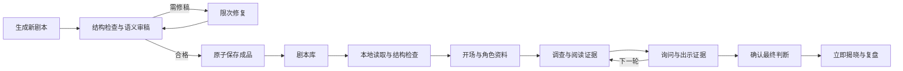

# 游玩流程优化方案

日期：2026-10-03。本方案已落实核心流程及界面改动；实施与验收记录见文末。改动兼容现有故事和游戏，不自动修订正在游玩的内容。

## 核心约定

审稿属于剧本制作流程。新故事生成、结构修复、语义审稿和必要的修稿全部完成后，才保存为可游玩的成品。再次打开成品、重新开一局、恢复存档和查看复盘均不触发在线审稿。

内容被明确编辑后，产生新的制作版本，修改后的版本在制作阶段重新检查。审稿算法升级、应用重启、APK 更新、画像生成和游戏轮次变化，均不构成重新审稿的理由。

玩家的主要循环是「获得信息 → 找到疑点 → 询问或出示证据 → 形成判断」。每次阶段变化都应服务这个循环；阅读资料和恢复进度不应制造额外轮次、模型请求或重复操作。

## 修改前确认的问题

| 环节 | 当前实现及依据 | 对游玩的影响 |
| --- | --- | --- |
| 现成剧本开局 | `StoryService.get_playable_story()` 在无通过缓存时调用在线审稿；Web `/games/load` 和安卓本地 `/games/load` 都调用它 | 启动成品又等待制作流程，失败后仍在首页；相同原文可能得到不同判定 |
| 生成结果持久化 | `create_story()` 审稿完成后保存剧本，但仅向进程内 `_reviewed` 添加通过记录；没有同时写出开局路径读取的通过缓存 | 生成后当前进程可复用，冷启动后仍可能重复审稿 |
| 首页反馈 | `HomePage` 的加载提示在剧本库，加载失败却写入新建案件卡片中的共享 `error` | 竖屏下用户可能只看到等待结束，看不到失败原因 |
| 开场 | `player_introduce_async()` 组装所有角色上下文并在线程中调用介绍方法，实际介绍已由扮演层直接返回公开身份；UI 还需点击一次进入搜证 | 存在不必要的上下文组装和分步操作，但默认介绍原本已不调用模型 |
| 轮次导航 | 速推 `return_to_investigation()` 在本轮完成后会增加轮次，按钮一直叫「返回搜证」 | 阅读或补查与开启下一轮的含义混在一起 |
| 证据阅读 | 搜证结果仅提示发现数量；讨论里的证据选择只展示摘要，侧栏没有完整证据板 | 玩家需要多次切换才能核对证据原文；阶段切换还可能推进轮次 |
| 提问恢复 | `DiscussionPhase` 先清空草稿再发送；安卓草稿只保存正文，没有询问对象和选中的证据 | 失败或退出后，问题可能丢失组合信息；乐观历史不能证明问题已被服务端接收 |
| 聊天阅读 | 消息数量或回应状态变化时，无条件滚动到底部 | 阅读旧证言时被新消息拉走 |
| 最终表决 | `vote_async()` 先等所有 NPC 的意见，再执行 `resolve_player_verdict()`；NPC 意见不影响玩家胜负 | 玩家确认了判断，仍需等待只用于复盘的内容；手机表决没有服务层的固定时限 |
| 揭晓 | `RevealPhase` 主要展示真凶、动机和完整故事，没有直接展示「我的选择与关键证据的对应关系」 | 结案反馈长，但玩家不容易看清自己判断对在哪里、漏掉了什么 |
| 回到游戏 | `NativeHome` 存档仅展示标题和「继续／复盘」，待完成任务与游戏分开 | 中断后不容易判断该进哪一局、继续哪个动作；完成动作可能需要回首页查找 |

说明：画像已采用后台生成，讨论已按同一轮冻结上下文并发回应，也已支持按角色定向询问。应保留这些现有能力，避免重做。结构校验已检查引用、依赖循环和调查轮次；下面的制作检查补足实际游玩可达性，不重复发明这些规则。

## 目标流程

| 环节 | 玩家看到的体验 | 是否需要在线模型 |
| --- | --- | --- |
| 首页 | 优先继续最近的游戏，其次从剧本库新开一局，最后提供生成新案件 | 否 |
| 生成新案件 | 展示实际的生成、检查、修稿、保存阶段；允许离开，完成后可从首页进入 | 是，属于制作阶段 |
| 现成剧本开局 | 读取本地成品、分配角色、保存新局，进入游戏页 | 否 |
| 开场 | 先看到扮演身份、案情、本人知识与目标；人物公开介绍可以直接阅读 | 默认否；额外交互才需要 |
| 搜证 | 选方向，获得证据，直接阅读原文，再选择是否带着证据提问 | 否 |
| 讨论 | 选择对象与证据，发送问题；逐个展示已经检查完成的回应 | 是 |
| 下一轮 | 明确显示本轮完成情况；点击「下一轮调查」才推进轮次 | 否 |
| 最终判断 | 核对案卷，选择嫌疑人，一次确认后保存结果并揭晓 | 否 |
| 复盘 | 先看判断结果与关键证据，再展开完整故事；人物额外意见按需查看 | 基础复盘否；额外意见可选 |

## 1. 成品开局与制作状态

### 成品必须真正可直接玩

1. 移除开局服务中的在线审稿。保留本地 JSON 读取及已有 `archive.validate()`，用于快速发现文件损坏、角色缺失和引用错误。
2. 在生成阶段记录并持久化制作结果。建议为存档增加可选的 `production` 元数据：`status`、`content_digest`、`review_version`、`completed_at`、`origin`；生成成功时以 `ready` 和正文一起原子保存。
3. `content_digest` 标识剧本正文版本，排除画像 URL 和制作元数据本身。它用于追踪制作结果，不作为在开局时自动调用模型的开关。
4. 正在制作与失败的草稿不进入成品库。修改成品时产生独立制作版本；未通过时保留原成品，不覆盖现有游戏的内容。
5. 审稿失败必须在制作阶段修稿；不能通过反复点击开局或无修改复核让负面结果随机变为通过。
6. 在需要画像的环境中，开局也不应隐式启动新的付费生成；使用已有画像或首字头像。画像任务归入制作流程或用户明确触发的资产补全。

### 旧存档的兼容

- 已保存的旧剧本缺少 `production` 时按旧成品兼容读取，仍可直接开局；不得因为缺少新元数据补跑在线审稿，也不得伪造「已通过新版审稿」记录。
- 本地结构损坏的档案立即给出不泄露答案的错误，原文件保留。已有语义问题记录可用于制作工具的修稿入口，不能把再次开局当成随机复核入口。
- 用户明确选择修订旧剧本时，生成新版本并执行制作检查。旧版本和正在进行的游戏均保留。
- 恢复游戏使用现有会话快照及兼容规则，不重新分配玩家、初始化线索或改写故事。

### 制作阶段检查实际可玩性

除现有结构和语义检查外，使用本地规则模拟速推三轮的调查可达性：针对每个可能分配的非凶手角色，检查场景证据、前置依赖、角色持有权及轮次安排，确认关键证据存在可达的获取或公开途径，不会因为分配了另一个玩家角色就失去定案条件。

该检查只验证规则可达性，不假装已经证明线索内容足以支持结论；语义上的因果关系仍由制作阶段审稿负责。`solution` 属于作者资料，游玩中不能直接下发或作为自动提示泄露答案。

## 2. 开场少等待，先入戏

将当前长页面收敛为案情概要、我的角色、我的目标三个主要区块，详细本人知识随时可以展开。不要强制阅读确认或逐屏点击。

NPC 的默认公开介绍在制作时生成并检查，随剧本保存；旧剧本以公开姓名和身份拼接确定性介绍，不能从 `secret`、全知背景或玩家不可见知识中临时拼装。玩家可使用默认介绍或编辑自己的介绍，记录后直接进入可调查状态。

人物公开介绍仍可回看。额外的开场互动是讨论能力的一部分，不要求每局先生成三位 NPC 的新自白。这样减少启动等待，也避免重玩同一剧本时开场事实漂移。

## 3. 调查、阅读与轮次分开

保留 `introduction → investigation → discussion → voting → reveal` 的领域阶段，以及速推三轮规则；优化操作含义和信息呈现。

- 「查看案卷／查看证据」：所有游玩阶段可打开只读面板，不改变阶段、轮次或持有权，不请求模型。投票前也可以核对。
- 「补充调查」：明确表示回到本轮搜证；如果要调整当前服务的推进语义，先补充领域和服务测试，并使用明确的动作契约。
- 「下一轮调查」：本轮完成后才推进；第 1、2 轮显示这个入口，第 3 轮显示「补充调查」和「提交最终判断」。不能只是改按钮文字后继续混用两种语义。
- 显示第几轮、是否已实际调查、是否已发表问题；提示只解释还缺哪个动作，不要求玩家填空式总结来增加额外步骤。
- 线索耗尽时沿用免调查规则，明确显示本轮已无线索可查，仍可讨论或按现有门槛继续。

调查成功后直接展示新证据的原文阅读卡，并提供「询问相关角色」入口，让用户选择询问对象与问题后再发送。普通点击证据卡仅阅读，不自动公开、不直接消耗模型请求。

证据列表保留「新发现」和阅读状态。分类、标题与原文要便于竖屏查阅；速推空状态提示「选择上方调查方向」，不再指向手机上不存在的通用「搜证」按钮。

## 4. 讨论围绕问题与证据

### 降低非必要回应

突出单角色询问，让用户清楚看到对象；全员讨论作为明确可选操作，并显示预计回应人数。后端已有定向过滤，不需要每次问题都调用所有角色。

继续使用冻结的角色上下文并并发生成所需回应。通过知识权限、来源和一致性检查的完整回应才能展示，不把未经检查的编码、思考过程或正文 token 流直接推给玩家。加快体验首先依靠减少无必要的请求，不删除事实检查。

### 可靠保存问题

草稿保存正文、询问对象和出示证据选择。发送时区分「尚未确认接收」「已接收、回应中」「部分回应已完成」「中断可继续」「完成」。

- 确认服务端或本地引擎已接收任务后，才清除已提交草稿；未接收失败则恢复组合信息。
- 已提交的问题保留原任务 ID。继续任务复用同一问题及冻结上下文，不重新发送一条相同问题。
- 客户端乐观消息需显示提交状态，不能把本地回显当作已写入记录的证明。现有按正文匹配恢复也要考虑询问和出示证据的规范化文本，避免错误判断接收状态。
- 全部角色回应失败时提示失败与继续选项，不把送达错误显示成有效证言。是否满足本轮发言门槛需明确沿用还是调整；若调整，先修改核心规则测试。

### 阅读不中断

用户在列表底部或主动发出问题时跟随新回复；翻看旧消息时显示新消息入口，不强制拉到最下面。回应期间仍可查看只读证据、角色资料和已有历史。

手机键盘弹出时继续沿用当前高度适配，保证发送按钮与最近消息可见；证据原文通过独立阅读面板查看，返回后保留输入、选择和阅读位置。

## 5. 最终判断立即生效

当前单人游戏已按玩家选择判定胜负。建议把这条规则贯彻到等待流程：

1. 玩家确认嫌疑人。
2. 通过领域方法记录玩家选择，计算胜负并保存终局快照。
3. 返回终局与已有真相资料，立即进入揭晓。
4. NPC 判断作为可选复盘内容，玩家主动点击后再生成；失败显示未完成意见，不改变胜负，也不把已结束的游戏恢复成投票阶段。

这需要修改任务编排和意见记录方式，不能简单地把 `resolve_player_verdict()` 移到现有 `submit_vote()` 之前：后者在 `reveal` 阶段不接受投票。新增复盘意见必须经过领域方法写入独立记录，兼容旧 `ballot_details`，并禁止修改终局结果。

如需保留 NPC 在揭晓前的真实判断，应在确认时保存各角色的权限过滤上下文；生成意见使用该快照，不给 NPC 加入终局真相。可选任务有独立状态，不能阻塞基础揭晓或恢复存档。

提前指认仍沿用现有一次性结案规则，但入口应清楚写明「提前结案」，保留一次明确确认；不能看起来像不会结束游戏的普通试探。

## 6. 复盘解释玩家的判断

复盘先展示「你的选择、实际真凶、判断结果」，再展示「关键结论 → 证据原文」的可折叠链条，最后提供完整故事与人物额外意见。旧档没有有效 `solution` 时只展示已有事实与故事，不现场调用模型捏造证据链。

可以显示哪些关键证据本局已获得、哪些未调查到，但不能把该信息下发到未结束的游戏。首次展示到真相时先核验终局权限，保持现有揭晓访问限制。

结案结果与基础复盘保存后可离线回看。重玩同一故事应清楚表示「同一案件的新一局」，与恢复原局区分；不暗示已经知道真相的重复游戏仍是首次破案体验。

## 7. 竖屏首页与恢复

首页顺序建议为「最近一局／待完成动作 → 剧本库 → 生成新案件」。游戏卡显示阶段、轮次、玩家角色和最近活动时间，按实际活动排序。现有故事入口写「新开一局」，现有游戏入口写「继续第 N 轮」，终局入口写「查看复盘」。

每个耗时动作的进度、错误和恢复入口留在触发动作的位置。生成失败留在制作卡，成品开局的本地错误留在该剧本卡；游戏内中断时就地继续原任务，首页仍提供统一入口。

任务显示真实动作名称和所属案件。进度只报告已知阶段与等待时间；未知剩余时长时不伪造百分比。没有恢复可能的结构错误与可以继续的网络中断使用不同的处理入口。

UI 离开后任务可能继续，也可能受系统后台限制而中断；恢复依据已保存任务状态，不承诺 Android 会无限后台执行。不因打开页面、轮询、继续存档或阅读资料隐式发送新的付费请求。

## 实施顺序

| 批次 | 改动 | 主要验收点 |
| --- | --- | --- |
| P0：先修启动 | 移除 `/games/load` 在线审稿；生成时保存制作结果；旧档兼容；错误就近展示；开局不触发资产生成 | 热启动、冷启动、APK 覆盖更新后，打开同一成品均不调用模型；本地损坏立即报错；旧游戏可恢复 |
| P1：连贯推理 | 只读案卷、明确下一轮与补查；发现证据后阅读与提问入口；正文及对象／证据草稿、提交状态；聊天滚动 | 看证据不改轮次，不公开私有证据；发送失败可恢复；继续任务不重复记录问题或回应 |
| P1：移除结案等待 | 玩家确认立即持久化揭晓；NPC 意见改为可选复盘任务；统一提前结案提示 | 未联网或 NPC 失败不阻塞胜负；断点恢复保持同一终局；旧表决记录可看 |
| P2：开场和复盘 | 制作时保存公开介绍；开场阅读简化；复盘证据链；首页活动信息与排序 | 默认介绍不调用模型、不泄露秘密；旧档可玩；无 `solution` 不虚构复盘结论 |

## 改动范围与验证要求

- 共享领域与服务：`backend/app/domain/models.py`、`game_manager.py`、`backend/app/services/story_service.py`、`session_service.py`。阶段及终局编排先修改相关领域、服务和 API 测试。
- API 契约：若新增任务接收状态、制作元数据摘要、明确的轮次动作或复盘意见接口，同步更新 HTTP Schema、Web 类型、小程序类型与接口测试；私有审稿原文不进入玩家 API。
- 安卓：`mobile_engine/mobile_runtime.py` 及任务／SQLite 存储需要兼容旧记录；保持任务 ID、完成事件和游戏快照的恢复逻辑，不删除手机已有数据。
- Web／安卓 UI：`HomePage`、`NativeHome`、各阶段组件、`GameContext` 与原生草稿桥接；手机竖屏、键盘、系统返回及阅读面板需真机复测。
- 小程序：同步共享阶段动作与终局语义，避免一端仍强制等待 NPC 表决或在查看线索时推进轮次。

必须覆盖的场景：新剧本完成后冷启动；旧成品无制作元数据；重复新开同一剧本；纯本地错误；三轮及末轮补查；线索耗尽；按角色询问及出示私有证据；问题尚未接收失败；部分回应后断网；进程重启继续任务；玩家表决提交与终局保存之间的恢复；NPC 可选复盘失败；旧存档、未终局揭晓拒绝；小屏键盘和系统返回。

性能验收先固定测试设备与剧本，记录成品点击至首屏、提问至首个完整回应、确认至终局三项耗时及实际模型调用次数。目标是成品开局和基础结案不依赖网络模型；在真机数据出炉前不承诺具体毫秒数或提升百分比。

## 实施与验收（2026-10-03）

已落实以下改动：

- 制作通过后将 `production`、公开介绍和正文原子保存；新制作版本在保存前模拟每个非凶手角色的三轮调查，核对结论所需证据实际可达。该模拟只用于制作，不修改正文的公开标记，也不代替语义审稿。成品开局只读文件与本地结构检查，不调用审稿或画像服务；旧档缺少制作字段仍可直接打开，明确非成品状态不进入剧本库。
- 补查始终留在本轮；新增 `next-investigation-round` 动作并检查本轮实际调查与发言。Web、安卓及小程序同步区分两种入口，最后一轮发言后才开放正式表决。
- 新证据自动打开原文，阅读面板可带着证据进入讨论草稿；侧栏和讨论选择面板提供完整的只读案卷。查阅不变更轮次、持有权或公开状态，发送时才按既有规则检查出示权限。
- Web／安卓按游戏保存正文、对象、证据和待确认动作 ID，兼容旧安卓纯文本草稿；收到持久化问题确认后才清正文与证据，沿用对象选择。SSE 和安卓轮询都回显权威历史，已接收的问题不会重复乐观插入；发送失败保留组合，聊天阅读旧证言时不自动跳底。
- 玩家确认后先保存终局，直接返回胜负；新增 `ballot-advice` 可选复盘任务，使用表决前冻结的角色视图，完成记录按角色保存。失败或恢复不改变胜负，也不重新打开已结束游戏；旧表决记录兼容。
- 默认公开介绍直接取制作结果或公开身份，一键介绍并进入调查。原默认介绍本就不请求模型，本次减少的是上下文组装与额外操作。复盘先显示玩家判断，再展开已保存的证据链和故事，不现场生成定案结论。
- 安卓首页显示角色、轮次和活动时间，区分继续原局、查看复盘与从剧本新开一局；失败记录默认折叠。游戏内可继续原中断任务，标题可从原路由恢复。真机发现提示栏继承阶段容器的 `flex: 1` 导致占半屏，已改为固定内容高度的横向栏。

新增字段均有旧档缺省值；快照版本升级为 3。没有删除已有故事、手机存档或任务记录，没有自动重写正在游玩的剧本。

自动与模拟验证：

| 检查 | 结果 |
| --- | --- |
| 后端 `pytest -q` | 280 项通过；覆盖冷启动成品、制作元数据、非成品拒绝、轮次、证据权限、终局和可选意见 |
| APK 实际 staged Python，无第三方依赖 | 3 项集成测试通过；覆盖三轮游玩、已完成角色复用、任务重启、终局快照先于完成回执、可选意见恢复与原视图不变 |
| Web | 5 个测试文件、lint、TypeScript/Vite 生产构建通过；草稿组合及串行写入、原生问题先回显、SSE 状态恢复均覆盖 |
| 小程序 | 状态测试、typecheck、weapp 构建通过；同步新轮次与即时结案 API |
| 手机尺寸模拟 | 320／360／407px 六阶段、长身份、长证据、指认固定确认栏无横向溢出；320×292 键盘剩余视口仍可发送 |
| 新流程 UI | 完整案卷阅读不触发动作；未接收发送保留组合且刷新后恢复；第一轮入口不出现正式投票；复盘先显示玩家选择且不自动请求人物意见 |
| 中断任务栏 | 320／360／407px 任务栏均为 61px，发送区保持可见；实际真机复测同样为 61dp |

### 真机完整速推

设备为 Redmi 2311DRK48C，Android 16，WebView 143，CSS 视口约 407×904。最终 APK SHA-256 为 `c8ec7dcaa3c8a6c422dbac47c3f859b097078be8076c58795680d401f12a23fc`，已用 `adb install -r` 覆盖安装。原密钥配置与 5 个游戏均保留，新增测试局 `64c679eb-a785-420a-88e7-3cbde7ae4f06` 留在首页可查看复盘。

- 关闭 Wi-Fi、移动数据原本关闭时，从现成《子夜当铺血案》新开速推成功。玩家沈默，默认介绍与进入调查均离线完成；一键介绍至调查约 257ms。未测量成品点击至首屏的精确时长，不据此报告开局加速百分比。
- 发现证据自动打开全文；带证据进入讨论只填草稿，问题数保持 0。第一轮发言前，将正文、钱伯安对象与怀表证据组合保存后结束进程；冷启动三项均恢复。第一条真实中文问题约 161ms 出现已接收回显后才清空草稿，不等待人物回答。
- 第一轮完成后点击补查，仍为第 1 轮，问题数 1、历史 7 均不变；点击独立下一轮动作才进入第 2 轮。三轮共实际调查到全部 15 条唯一证据，正式投票在末轮讨论完成后开放。
- 实际中文键盘打开后剩余约 407×556dp，聊天区约 263dp 高，对象和证据栏可见，发送按钮 y=498～546，处于剩余视口内；没有横向溢出。中文内容由测试工具填入，此轮没有重复验证拼音组词。
- 第三轮问题已保存、角色尚未回复时结束进程；冷启动保留任务 `cf37328f-803e-4418-ad2b-1bf0b15e8141` 为 interrupted，问题数 3、历史 10，没有自动继续。此时又覆盖更新修复任务栏，再从游戏内继续同一 ID；该动作问题和回复各保存一次，原草稿按已接收历史清空。没有导出原始调用回执，不能确认停止瞬间供应商是否已收费或重试是否产生重复费用。
- 测试脚本第一次按正文“鞋印”匹配误选了沈默绣架，随后按完整标题精确选择账房侧门与鞋底，并在第 3 轮补充一次真实提问。最终共 4 个唯一问题、4 个角色回应，加上 5 条介绍共 13 条事件；中断动作没有重复问题。该误选属于测试操作，未修改游戏内容。
- 再次关闭 Wi-Fi，选择钱伯安并确认，约 168ms 显示含玩家判断和真相的基础揭晓，`winner=good`；人物意见保持 available，没有为其等待或主动生成。4 段作者证据链可展开。随后离线结束进程、冷启动复盘，仍是同一胜负、15 条线索、13 条事件。两项毫秒数是单台设备、单局样本，不能视为平均值或性能保证。
- 测试结束恢复 Wi-Fi 开启，移动数据维持原关闭，手机留在游戏首页。没有删除旧故事、原存档或失败记录，没有导出手机完整数据库，也没有读取或打印 API key。

模拟测试和本机实玩不能代替其他机型、系统大字体或经典模式的完整实玩。NPC 对账册能给出人物回答，对部分证据质问仍退回引用原文的保守答复；流程贯通不证明角色回答质量已全面解决。

本次没有新增剧本编辑器；独立内容修订版本仍是制作约定。没有重新生成新案件来衡量撰稿速度，也没有修改此前已确认的旧稿内容矛盾。角色审查仍沿用原机制，流程验证不等于自动生成质量全部合格。小程序同步核心规则与复盘，组合草稿的原生持久化验收限于 Web／安卓。
