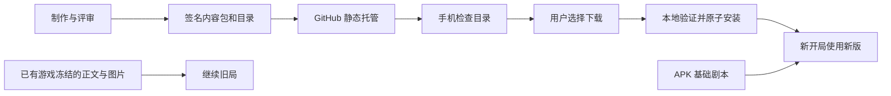

# 剧本内容独立更新

状态：2026-10-05，Android 首期代码、构建和 content-r1 附件已完成，六个远端包已逐一核对哈希和签名；签名目录随本次提交启用，支持客户端为 preview.3。手机已同签名覆盖到 preview.3，配置与存档文件保留，联网、取消、离线安装、中断恢复及连续三次冷启动验收完成。已发布 preview.2 不具备此能力；需首次升级到 preview.3。本文记录实现契约与验收边界，实际测试见文末。

## 目标与交付边界

安装一次支持内容更新的 APK，以后新增故事、补充配图或修订证据链，通过下载内容包交付。用户无需电脑、自建服务器或开发工具。APK 继续负责游戏引擎、界面、模型设置、原生网络和存档；内容包只包含 JSON、图片与来源许可文件，不包含可执行代码。

首次需要升级 APK，因为当前客户端没有目录检查、内容包安装和本地图片服务。后续兼容引擎的内容更新无需重装；改变游戏规则、内容格式或原生能力仍需要更新 APK。

下载剧本不需要 API key，也不调用模型。AI 对话仍需要用户自己的密钥与网络。已安装故事可离线打开和查看资料，但这不等于离线 AI 游玩。开局只做本地加载与结构检查，不重新审稿、生成正文或生图。审稿、证据检查和体验评审属于内容制作及发布流程。

首期包括官方目录检查、手动下载/更新、下载取消、离线安装签名内容包及版本隔离。暂不做后台定时下载、自动替换全部故事、账号同步、远程代码更新或存档跨设备迁移。Web 后续复用协议，由后端执行安装；微信小程序不纳入首期交付。



## 已落实的架构调整

| 原有行为 | 实现调整 |
| --- | --- |
| `story_catalog.py` 只读取随应用发布的 manifest | 合并 APK 基础内容与独立安装的官方内容，以版本选出新开局使用的故事 |
| `EngineHost` 启动时覆盖复制 APK 的目录文件 | 基础目录继续只接收 APK 内容，下载包使用独立目录；覆盖前保留旧档所需的旧正文 |
| 图片随 Vite/APK 打包，地址没有下载版本信息 | 保持旧地址有效；新增不可变的版本图片地址，由原生层读取应用私有文件 |
| `/stories/import` 导入普通 JSON，统一属于个人剧本 | 保留此接口；新增签名 `.mmstory` 安装通道，只有受信发布者的内容可进入精选库 |
| 游戏、生成和桥接任务共用部分队列与锁 | 内容下载使用独立工作队列，不占用游戏命令锁或模型请求队列 |
| 新会话冻结完整 archive，旧会话可能只保存 story_id | 保持正文冻结，再记录可选内容引用，保护历史图片；迁移旧档时不能直接读取更新后的正文 |

## 用户看到的流程

保留首页“精选剧本 / 我的剧本 / 自行生成”。精选下增加“已下载 / 发现新本”，不增加启动必经页面。首次安装即显示 APK 基础本，不等待联网核验。

“发现新本”读取上次成功验证的目录；首次进入可检查目录，回到前台最多每 24 小时做一次轻量检查，用户也可随时点“检查更新”。这是应用内行为，不创建系统定时任务。检查只拉目录，不自动下载剧本；断网保留缓存，并显示上次检查时间与本次失败提示，不误报“已经是最新”。

卡片只展示公开简介、人数、难度、预计时长、作者和下载大小。未下载故事使用案卷占位封面，安装后显示本地配图；不为了浏览目录另行请求远程图片。预计时长属于设计估计。

| 状态 | 主要操作与文案 |
| --- | --- |
| 未下载 | “下载剧本”，同时显示大小；点卡片查看无剧透简介 |
| 已安装 | “开始游玩”，离线不阻塞 |
| 有可用新版 | “开始游玩”仍可用，另设“更新”及修订说明 |
| 下载/校验/安装中 | 显示实际阶段；下载显示真实字节进度，提交前可取消 |
| 引擎不兼容 | “需要更新应用”，保留可游玩的已安装版本 |
| 失败或中断 | 简短中文原因与“重试”；旧版仍可用 |

竖屏卡片单列，操作触控区至少 44px，文字状态不能只靠颜色区分。现有 `.shelf-book` 是整张按钮，新卡片应改为普通容器加独立操作，避免嵌套按钮。下载刷新保留滚动位置；进度留在剧本库，不用全屏蒙层遮挡当前讨论或输入法。

## 内容来源与版本选择

继续保留 `origin=builtin/generated/imported/legacy` 的现有语义，新增可信加载器设置的 `delivery=bundled/downloaded`，区别基础精选本和下载精选本。包内自行声明的 origin、delivery、认证或“已审稿”字段不能成为信任依据。

新开局对每个官方 UUID 选择最高的兼容、校验通过、安装完整的内容版本。未下载、下载失败或要求更高引擎的候选包不参与选择。玩家已开始的局直接使用冻结 archive，不重新选择版本。

同一 UUID 的文本、证据、角色数或图片变化均增加 `metadata.version`。每个已发布的 UUID + 内容版本只能对应一个不可变内容包，不能原地修订；网络更新不能降级，同版本不同哈希拒绝。重复安装相同哈希返回已安装，支持提交成功后丢失应答的恢复。新版本可以改变人物数量，但旧局保留自己的人物与进度。

基础包没有 ZIP 哈希时，由构建工具生成正文与配图的内容指纹：对 `package.json` 及 artwork 引用的图片（含 retained_files）按统一逻辑路径排序，记录各文件的 path、bytes、sha256，再对 `{fingerprint_format: 1, files: [...]}` 的 UTF-8 紧凑 JSON 求哈希。序列化固定为键排序、逗号/冒号分隔、无 BOM/结尾换行；图片逻辑路径统一为 `images/<filename.webp>`。下载清单能导出同一指纹，同版本正文或图片不同仍须拒绝，不能把基础包的 null 哈希当作忽略版本冲突的理由。

官方包与个人剧本 UUID 冲突时保留个人内容、拒绝安装并报告冲突，不把个人内容升级成精选，也不覆盖个人文件。撤回条目停止推荐和新下载，不删除用户已安装的内容或存档；修复通过更高版本发布。首期不提供用户主动降级，当前在玩案件不受更新或撤回影响。

| 字段 | 含义 |
| --- | --- |
| `catalog_revision` | 官方稳定目录的全局递增修订号 |
| `metadata.version` / `content_version` | 单个故事的正整数内容版本，二者必须一致 |
| `catalog_format=1` | 目录 payload 格式 |
| `bundle_format=1` | 外层安装包格式 |
| `format_version=1` / `package_format=1` | 沿用现有内层剧本 JSON 格式 |
| `min_engine_version` | 内容能力协议版本，独立于 APK 的 versionCode |

首期引擎内容能力编号为 1，支持现有 3—8 人、三轮证据、现有 solution 格式与 WebP 图片。APK 版本号升高不自动提升此编号，只有实际新增内容能力才提升。基础本也纳入同一解析与兼容检查。

## 签名目录与内容包契约

官方目录和包清单均使用一个签名信封，避免把目录和签名放在两个地址导致 CDN 版本不一致：

```json
{
  "envelope_version": 1,
  "algorithm": "SHA256withECDSA",
  "key_id": "official-content-2026-01",
  "payload_b64": "<原始 UTF-8 payload 字节的标准 Base64>",
  "signature_b64": "<DER 编码签名的标准 Base64>"
}
```

发布密钥采用 P-256，算法固定为 `SHA256withECDSA`。客户端先限制信封长度、解码、用应用内受信公钥验证，再解析 payload 或展示条目；不能先读未认证内容到卡片中。`key_id` 只选择内置公钥，不接收包里附带的公钥。必须验证解码后的原始字节，不能解析 JSON 再序列化验签。

待签名字节分别为 `MMG-CATALOG-V1\n` + 目录 payload 原始字节、`MMG-BUNDLE-V1\n` + 包清单 payload 原始字节，前缀中的 `\n` 是单个 LF 字节。固定前缀区分两类签名，固定算法避免由输入选择算法。实现时验证目标 Android API 上的实际签名格式与兼容性；使用平台 [Signature API](https://developer.android.com/reference/java/security/Signature)。

内容签名私钥独立于 APK 签名密钥和模型 API key，只存在于发布者的安全环境；APK、仓库和内容包只能携带对应公钥。首期换根公钥需要 APK 更新，暂不实现远程根密钥轮换。签名证明内容来源与字节完整，不能代替剧情质量评审。

目录不设置要求频繁续签的硬过期时间。记住已接受的最高目录修订号及 payload 哈希：低修订拒绝，同修订不同 payload 拒绝。它防止已知目录被回滚，但不能证明第一次收到的目录就是发布者最新版本；界面以实际检查时间说明状态，不把签名当作“绝对最新”的证明。

### 官方目录 payload

顶层为 `kind=murder-mystery-catalog`、`catalog_format`、`catalog_revision`、`publisher`、`channel=stable`、`issued_at` 与 `entries`。首期固定发布者标识 `Rookiecoder-jsjs/Murder-Mystery-Game`，不接入任意第三方目录。UUID 不重复，版本及大小为正整数，哈希为小写 64 位十六进制；JSON 拒绝重复键，时间使用带时区 ISO 8601。

每项包括 `story_id`、`content_version`、`title`、`summary`、`num_characters`、`difficulty`、`estimated_minutes`、`author`、`license`、`release_notes`、`min_engine_version`、`package_format`、`bundle_format`、`bytes`、`sha256`、`download_urls` 和 `status=active/withdrawn`。目录不包含真相、凶手、角色私密剧本或完整线索。

`sha256` 和 `bytes` 指向整个 `.mmstory` 文件。安装时核对目录、清单和正文的 ID、版本、公开元数据及能力要求，防止目录介绍与实际包不同。一个条目只列当前推荐版本，历史包仍保留固定发布地址。示例见 [目录 payload](examples/story-updates/catalog.payload.example.json)，是占位演示，不可直接安装。

目录自身格式不受支持时保留旧缓存；单个条目的引擎要求或包格式不受支持时，仅标记该条目不可安装，不让整个目录失效。未来超过当前人物范围的本同样根据能力要求单独禁用。

### `.mmstory` 文件

一个 ZIP 容器包含正文、可选配图与来源文件，文件布局固定：

```text
bundle.json              # 包清单的签名信封
package.json             # 现有 format_version=1 剧本包
images/cover-v1.webp      # 可选，纯文字本允许没有 images/
images/char_1-v1.webp     # 可选，角色头像
LICENSE                  # 本包适用的完整许可
SOURCE.txt               # 作者、固定源码提交及来源地址
```

清单 payload 包含 `kind=murder-mystery-story-bundle`、`bundle_format`、`publisher`、`story_id`、`content_version`、`min_engine_version`、`package_format`、`source_commit` 与 `files`。`files` 逐项列出 `path`、`bytes`、`sha256`，覆盖正文、图片、LICENSE 和 SOURCE.txt；不列 `bundle.json` 本身，避免签名哈希循环。示例见 [包清单 payload](examples/story-updates/bundle.payload.example.json)。

ZIP 的全包哈希由签名目录约束；清单自己的签名及各文件哈希支持离线安装官方包。离线安装不要求能连接目录，仍须通过受信签名、版本和全部本地校验；不能证明未被发布者后续撤回，界面不声称已完成在线最新状态检查。未知签名包拒绝，普通个人 JSON 继续走现有导入。

首期实际限额：目录/清单信封 2 MiB、ZIP 20 MiB、实际展开总量 40 MiB、最多 64 个文件、单图 4 MiB/1600 万像素，正文 JSON 沿用 2 MiB。边读边计数，不信任 ZIP 头声明的大小。拒绝绝对路径、路径穿越、符号链接、重复路径、加密 ZIP、未列入清单的文件，以及 HTML/SVG/脚本等非白名单资源。图片实际解码验证后才激活；文件名继续使用现有 WebP 命名约束，角色图片映射不能引用不存在的人物。

发布工具固定文件顺序、时间戳与压缩参数，输出可审查的文件清单。ECDSA 签名本身可能带随机性，因此不能宣称每次重签都得到相同 ZIP：已签名发布产物应保存并复用，同版本重建只允许验证既有产物，不能重签后覆盖远端。

## 下载、安装与本地存储

官方文件使用 HTTPS，只允许预先配置的官方 API/原始目录、附件及经验证的 GitHub CDN 重定向主机；重定向也需校验协议和主机，不接受任意地址。使用独立无鉴权内容下载器，不复用会附带模型密钥的 `NativeTransport`。提供连接/读取超时、手动重试和取消；失败返回真实原因，不自动切换未知公共代理。

内容下载使用 Android 应用私有目录，不申请共享存储权限。应用专属文件的访问和卸载行为依据 [Android 存储文档](https://developer.android.com/training/data-storage/app-specific)：卸载会删除，覆盖更新保留的内容由迁移逻辑保证。目录规划：

```text
files/
  bundled-stories/catalog/                     # 原 APK 基础正文目录
  game/stories/                                # 个人生成/导入，保持现有位置
  game/game.sqlite                             # 原游戏与模型任务数据库
  story-library/
    catalog/cache.json                         # 已验证签名信封与检查状态
    tasks/<task-id>.json                        # 内容任务，不记录模型配置
    staging/<task-id>/                          # 不参与剧本列表
    packs/<uuid>/v<version>-<zip-sha256>/        # 不可变、完整安装文件
    registry.json                              # 唯一可见安装索引
```

首期不修改游戏 SQLite 的表或 user_version。Android 的 `StoryLibraryHost` 是任务、安装索引与激活操作的唯一写入者；Python 共享服务只读取原子索引与完整包，不自己写第二套目录。Web 实施时也只安排一个安装写入者。目录检查及安装在独立队列中串行，耗时操作不能进入 `EngineHost.command` 的同步锁。

registry 至少记录格式版本、library_revision、每个官方 UUID 的最高已安装内容版本、各完整版本的哈希/指纹/相对路径与激活状态。目录中未下载的新版不能提升此安装版本。移除激活仍保留版本记录，不能借移除绕过降级限制。个人导入/保存与官方激活共用短时的剧本命名空间锁，只有最终冲突检查及原子提交持锁，不在锁内下载、审稿或解析全文，防止同时安装和导入相同 UUID。

安装顺序如下：

1. 从已验证目录锁定 UUID、内容版本、大小和哈希；持久化任务，检查空间，建立 staging。
2. 下载到临时文件，按实际流量限制大小；校验整个 ZIP 的长度与 SHA-256。
3. 安全枚举 ZIP，验证 `bundle.json` 的签名，再逐项核对清单与实际解压字节、文件哈希。
4. 调用共享的 `parse_package` 与 `validate_quick_evidence_routes` 做正文验证；核对公开元数据、版本、ID、人数和 artwork，验证所有图片。只开放固定本地验证方法，不能由包指定 Python 函数。
5. 写入完成标记，同文件系统移动到不可变 packs 路径；同步文件与目录。再次检查索引版本及个人 ID 冲突，然后以临时文件 + fsync + 原子替换提交 registry。
6. registry 提交是唯一可见时刻。记录任务成功、增加 `library_revision` 并通知界面；成功应答丢失时，下次以索引恢复结果。

失败或取消发生在提交前时，旧索引保持可用。只有文件移动但未提交索引的目录不对外可见，可恢复验证或清理；索引已提交但任务尚未标成功时，恢复为成功，不撤销已激活的完整包。取消与提交竞争时，以提交结果为准。

首期不做 HTTP Range 断点续传，部分下载重试从头开始；完整且哈希正确的 ZIP 可以复用本地安装步骤。进程退出后，未提交任务标为中断，用户重试；不能把临时文件误认为已安装，也不能承诺退出应用后持续下载。

取消请求直接设置线程安全的取消标志，并关闭当前下载流，不排到正在执行下载的同一串行队列末尾。任务文件仍由唯一写入者更新，registry 提交前再次检查取消标志。阶段与字节进度可从内存快照读取，界面查询不能等待整个下载完成。

## 配图地址与旧存档保护

已有 `/assets/story-library/<uuid>/<filename.webp>` 地址保持有效，首次更新 APK 保留首批三个本的图片文件与历史文件名，遵守 [retained_files 规则](story-artwork.md)。下载包使用独立地址：

```text
/assets/story-library/packs/<uuid>/<version>/<zip-sha256>/<filename.webp>
```

`StoryAssetHandler` 通过自定义 `BridgeWebViewClient.shouldInterceptRequest` 只处理应用 HTTPS 本地来源与该精确路径前缀，验证 UUID、版本、哈希、文件名及完成标记后返回 `image/webp`。其他请求交给 `super`，保留 Capacitor 的本地资源、导航和生命周期行为。当前安装的 Capacitor 提供 `setWebViewClient`，实施仍需覆盖资源加载与页面跳转测试；不改整个 WebView 的资源根目录。

可信加载器派生 cover_url/portrait_url，忽略包里自由填写的 URL。`archive.catalog` 增加可选 `content_ref={story_id, version, bundle_sha256, delivery}`，然后沿用 schema_version=4 冻结完整正文和图片 URL。新字段有缺省兼容，不进入角色知识或模型上下文；基础包的 bundle_sha256 可为 null。

旧快照已有完整 archive 时，恢复仍直接用它，不改人物、证据、阶段或图片地址。仅有 story_id 的旧档，应在首次覆盖基础正文前备份旧目录，再在恢复时用备份冻结；不能从最新正文推断已经丢失的历史版本，缺失时明确记录限制。

首期保留所有安装过的完整版本，以保证旧局与复盘图片可用。“移除下载”取消该 UUID 下全部下载版本的新开局激活，有基础本则回到基础本；有存档引用时保留图片并说明空间仍被占用，基础本不可移除。重新下载相同版本可复用完整包并重新激活。后期清理只能删除既不被任何存档引用、也不活跃的版本；旧档缺少 content_ref 时需检查旧 URL 或保守保留。`library_revision` 与游戏 revision 分开，内容更新不能重建正在运行的 GameSession。

## 接口约定

Android 已注册原生 `libraryRead` / `libraryCommand` / `libraryImport`，前端由 `api/storyLibrary.ts` 统一访问。下表 HTTP 路径只表达逻辑语义，Web 尚未注册这些路由；手机不运行 HTTP 服务。任务状态随 libraryRead 的 tasks 返回，命令返回完整任务快照。

| 逻辑接口 | 请求/响应与规则 |
| --- | --- |
| `GET /story-library` | 返回本地已安装与已验证目录投影、last_checked_at、last_check_error、library_revision；读取不自动联网 |
| `POST /story-library/check` | 返回 task_id，后台拉取并验证目录 |
| `POST /story-library/install` | 请求 story_id、content_version、expected_sha256；只接受受信目录对应条目，返回 task_id |
| `GET /story-library/tasks/{id}` | 状态、阶段、已下载字节、目标字节、中文错误与错误码 |
| `POST /story-library/tasks/{id}/cancel` | 提交前可取消；已提交返回已完成 |
| `POST /story-library/install-file` | 原生选择器读取 `.mmstory`；不接受任意私有路径，读入后走同一验证/安装队列 |
| `POST /story-library/uninstall` | 请求 story_id，只移除下载内容的激活；不删除基础本、个人本或存档 |

下载任务状态为 `queued/downloading/verifying/installing/complete/failed/cancelled/interrupted`，目录检查额外使用 `checking`。百分比只由下载字节计算，校验和安装显示阶段，不按时间伪造百分比。进度轮询或事件经过原生桥，不进入现有模型任务持久化通道。

错误码至少包含 `CATALOG_UNAVAILABLE`、`SIGNATURE_INVALID`、`HASH_MISMATCH`、`PACKAGE_INVALID`、`ENGINE_UNSUPPORTED`、`NO_SPACE`、`INTERRUPTED`、`VERSION_CONFLICT`、`ID_CONFLICT`。磁盘实际写入失败也转成对应可恢复错误，不仅依赖安装前的空间估计。

列表投影保留现有公开 Story 字段，可添加 `installed_version`、`latest_version`、`delivery`、`download_bytes`、`install_state`。尚未安装的条目不能加入当前可开局 `/stories` 列表。新增 `mystery:library-updated` 事件只刷新目录与首页，不能触发当前游戏全量恢复。引擎缓存以 registry 修订号失效，保证更新后下一局实际读取新包。

## 发布渠道与制作验收

使用现有 GitHub 仓库托管静态内容，用户无需提供自己的服务器。方案采用仓库 `content/catalog.json` 的 HTTPS 原始地址作为稳定目录，包放在独立的 `content-r<catalog_revision>` Release 附件中；受信公钥与固定目录地址已配置，首份签名目录为修订 1；[content-r1 附件](https://github.com/Rookiecoder-jsjs/Murder-Mystery-Game/releases/tag/content-r1)已经发布。

目录文件仍位于 master 的 content/catalog.json。客户端优先从 `https://api.github.com/repos/Rookiecoder-jsjs/Murder-Mystery-Game/contents/content/catalog.json?ref=master` 以 `Accept: application/vnd.github.raw+json` 取得同一原始信封，备用为 `https://raw.githubusercontent.com/Rookiecoder-jsjs/Murder-Mystery-Game/master/content/catalog.json`。这两个地址只来自 APK 公开配置；网络失败才尝试备用，验签失败直接拒绝。公开目录不需要 GitHub 令牌，约定见 [官方 Contents API](https://docs.github.com/en/rest/repos/contents#get-repository-content)。每个包使用固定标签的 `/releases/download/content-rN/<uuid>-vM.mmstory`，不能依赖仓库 `/releases/latest`，避免内容 Release 与 APK Release 混用。GitHub 的公开 Release/附件接口可不带访问令牌读取，发布流程参考 [Release 文档](https://docs.github.com/en/rest/releases/releases) 与 [附件文档](https://docs.github.com/en/rest/releases/assets)；实现时验证实际重定向链、下载可达性和客户端主机白名单。

发布顺序为：完成正文及许可来源 → 本地结构/证据检查 → 编辑与实际体验评审 → 打包签名并生成报告 → 上传不可变包 → 从远端核对完整哈希与长度 → 最后发布签名目录。目录不能先指向尚未上传的包。未来镜像必须由同一签名目录列出并返回相同字节，不改用不受信代理。

内容 Release 设置字符串参数 `make_latest="false"`，避免占用应用版本的最新发布入口；客户端始终使用签名目录中的固定附件地址。参数约定见 [GitHub 创建 Release 文档](https://docs.github.com/en/rest/releases/releases#create-a-release)。

发布工具为 `scripts/package-story-content.py`，默认 dry-run，仅输出检查报告；指定签名参数后才输出包与签名目录，不自动上传或读取模型密钥。输入按源码与资源白名单取材，禁止把 `.env`、模型配置、发布私钥、用户数据库、存档或日志放入包及源码附件；占位全零哈希与 source_commit 必须使发布失败。发布时间、源码提交、编辑记录和内容版本必须可追溯，旧版本不覆盖。

当前新增三个原创本已做本地结构与引擎流程验证，真实模型/玩家体验评审仍未完成，不能据此宣称已经通过精选质量验收。发布前的评审不下放到用户开局。APK 的对应源码、构建说明及许可交付沿用 [仓库许可说明](licensing.md)，不能只给会移动的默认分支链接。

## 分阶段实施与验收

1. **共享内容层**：实现受信注册表读取、版本解析、不可变内容引用与普通导入隔离；补齐新旧会话冻结、旧正文备份与迁移。现有个人 JSON 导入不变。
2. **安卓安装层**：实现签名、公钥配置、独立下载队列、任务恢复、原子激活与图片拦截；离线包与在线包共用校验，不进入游戏/模型任务锁。
3. **剧本库与发布工具**：实现已下载/发现新本、状态和修订说明，完成 dry-run 打包及目录生成。只使用本地假目录/测试服务验证故障，不把未获准发布的稿件发送出去。
4. **首个支持更新的 APK**：保持同签名覆盖与首批三本的基础内容和图片，新三个本通过内容包增加，实际证明不用再构建 APK 就能从三本扩展到六本。当前源码 manifest 有六本，实施时须新增明确的基础包选择配置，不能随意删稿或默认把所有本重新打进 APK。完成验收后再发布内容与安装包。

| 必须通过的场景 | 预期结果 |
| --- | --- |
| 首次安装、断网、无 API key | 基础目录和资料可用；联网下载不索取模型密钥；AI 请求沿用原有设置提示 |
| 目录不可达、非法签名、修订回滚 | 保留上次可信目录，不显示未认证内容；明确失败时间和原因 |
| 下载断网、取消、空间不足、杀进程 | 旧版可开局；临时内容不可见；恢复显示中断或已完成的真实状态 |
| 安装各阶段崩溃、提交与取消竞争 | registry 只有完整旧版或完整新版，没有半安装；提交后丢失应答可恢复 |
| 字节篡改、Zip 穿越/重复项/超量图片 | 拒绝激活，不改个人内容或官方旧版 |
| 同版本相同包、不同包、旧版本 | 幂等成功、冲突拒绝、降级拒绝 |
| 不兼容新本或新版 | 只禁用对应下载/更新；兼容已装本继续可用 |
| 个人 UUID 冲突、伪造精选字段 | 个人本保留，不能冒充精选；原 JSON 导入照常工作 |
| v1 游戏开到中途，再安装 v2 | 旧局正文、人物、线索与图片完全不变；新开局用 v2 |
| 离线安装签名包、移除有旧档的下载本 | 离线校验可完成；移除不使旧局及复盘缺图 |
| 同签名覆盖首次更新 APK | 手机密钥与全部存档保留，历史图片仍能加载 |
| 小屏竖屏、大字体、输入法、列表刷新 | 按钮清晰可点，无嵌套按钮和遮挡，下载不阻塞讨论与滚动 |

实现位置：共享层新增 `backend/app/services/story_content_service.py` 并调整 `story_catalog.py` / `story_service.py`；手机调整 `mobile_engine/mobile_runtime.py` 与构建白名单；原生新增 `StoryLibraryHost.java`、`StoryAssetHandler.java` 并扩展 `GameEnginePlugin.java`；前端新增 `api/storyLibrary.ts` 与剧本库组件，调整 `HomePage`；新增发布脚本及上述故障/兼容测试。具体拆分以现有代码边界为准，不重写游戏状态机。

## 当前验证与发布操作

- 后端全套 336 项通过；补充安装恢复校验后，受影响内容服务 11 项通过。
- 前端 6 个测试文件、lint、类型与 Android 构建通过；原生 8 项测试覆盖实际 P-256 验签、签名篡改、域混用、路径穿越、加密/符号链接 ZIP、文件哈希和目录格式拒绝。
- 手机纯 Python 引擎 6 项通过：三本基础内容扩展到六本、动态人数、冻结存档与旧版私密事件迁移；假传输器没有发起模型调用。
- 发布工具 3 项通过：真实 OpenSSL 验签、目录同修订复用与回退拒绝、固定 Git 源码和同版本包字节复用。
- 组件在 320/360/412 像素及 125% 字体下，无横向溢出或嵌套按钮，主要操作触控区至少44px；发现页将新增内容排在不变基础本前。此项为桌面模拟，不能代替真机。
- APK 递归检查通过：3 个基础剧本、18 张配图及受信公钥与源码一致，没有凭据或电脑用户数据。

发布者在仓库外保管内容签名私钥。先提交正文、资源、许可与实现，再使用固定提交打包；不要把私钥路径作为仓库配置。示例：

```bash
python3 scripts/package-story-content.py
python3 scripts/package-story-content.py --revision 1 --source-commit <40位提交> --signing-key <仓库外私钥>
# 后续发布需保留已发布的 mmstory 字节，并指定上一份签名目录：
python3 scripts/package-story-content.py --revision 2 --source-commit <40位提交> --signing-key <仓库外私钥> --previous-catalog <上一份目录>
python3 scripts/tests/test_story_publisher.py
```

输出位于被 Git 忽略的 dist/story-content；逐项检查 report.json，上传固定标签附件并核对哈希后，再提交 catalog.json 到 content/catalog.json。工具不自动上传，也不调用审稿模型。源码改变、但正文/图片未变时继续复用旧包；正文/图片改变必须升 metadata.version。同目录修订的内容变化和回退均拒绝。

六个远端附件的长度和 SHA-256 核对通过，并由实际 Android ContentVerifier 在 JVM 上全部验签与解包。Redmi / Android 16 已同签名覆盖到 versionCode 16，升级前后 game.sqlite、加密 model-v1.xml 和 drafts-v1.xml 的 SHA-256 完全一致，没有卸载、清数据或执行电脑锁屏。

真机14个旧存档公开摘要及 configured=true 保留，首页406像素无横向溢出。发现原始目录域名在手机网络上超时，而官方 API 约867ms返回相同7642字节目录，已补充该官方入口与备用顺序。真机已通过官方目录读取、花房本联网下载、晚宴本取消下载与系统文件选择器离线安装。中断测试发现启动锁顺序互相等待，已调整为完成基础资源准备后再进入内容库初始化锁；最终连续三次冷启动通过，六本内容和17个游戏均可读取，其中14个原存档的公开摘要完全一致。新增三个本地开局为4/6/8人，未触发模型请求。实际制造磁盘满或每个安装指令点断电未验证。当前不承诺后台持续下载、Range 续传、自动删除历史图片或任意第三方内容源。


真机普通 GitHub 附件入口也出现过连接超时。下载器会在网络失败后尝试同一官方仓库的 Release API；根据签名地址固定标签和文件名，并核对附件大小、原始下载 URL 与 API 仓库归属。获取后仍执行目录 SHA-256、签名、文件清单与安装校验，API 元数据不能改变受信内容。该入口无需令牌，支持200/302，见 [GitHub 官方附件下载文档](https://docs.github.com/en/rest/releases/assets#get-a-release-asset)。哈希、签名或路径校验失败不会借备用入口放行。下载地址数组按序处理，换入口从零重新下载，不声称断点续传。


最终 APK 对应源码 `19f5d6a7f7fdebebd58b8b16a14d17d3e2dfdcf8`，SHA-256为 `561dc5e021198f9a204579b5bc3cb1faadc7173c9cbf578a71e052ebfa02dc42`。真机返场本重试完成；六本均已安装，取消与中断错误保留可读记录。最终版本递归凭据检查、同签名覆盖及源码归档检查通过。发布包与免费对应源码见 [preview.3](https://github.com/Rookiecoder-jsjs/Murder-Mystery-Game/releases/tag/v1.0.0-android-preview.3)。


内容r2已发布三个v2封面包，前三个基础包仍使用content-r1原字节与原URL。三个新包从公开下载地址核对长度和哈希通过，Android验签器对目录六个条目全部验签、解包通过。发布器复用旧包时报告也沿用旧签名清单，避免源码提交变化造成报告中的SOURCE.txt哈希偏差。对应测试通过。签名目录切换至revision2；图片接入后的后端全套337项、手机Python6项、发布工具3项通过。手机在r2最后验收前自动锁屏，当时尚未完成三张新图的真机显示验证；后续r3更新已同时完成三张封面与18张画像的验收，见后文。APK下载、六本安装、取消、中断恢复、离线选择器与三次冷启动验收不受此限制。


内容r3新增三本全部18张角色画像，内容版本均升为3；前三个基础包保持原字节，新增三本的正文和v2封面不变。角色映射和画像清单见 [配图记录](story-artwork.md)。旧存档继续使用冻结的版本，[content-r3](https://github.com/Rookiecoder-jsjs/Murder-Mystery-Game/releases/tag/content-r3)已发布三个v3签名包。远端长度与SHA-256核对、实际Android验签器六个条目验签/解包、337项后端与6项手机Python及3项发布工具测试通过；包内凭据检查通过。签名目录在这些验证完成后切换至revision3，Redmi / Android16已通过精选库的检查更新和三次更新操作完成v1→v3下载，三个任务实际字节数分别为462120/491680/548944。手机本地21张图（18画像、3封面）的哈希、类型、尺寸与解码通过，4/6/8人新开局角色映射与开场图像正常，406px竖屏无横向溢出。原17个存档公开摘要与3个旧局的status/clues/history完全不变；3个新增本地测试局后共20个游戏，冷启动前后20个摘要及6个新旧快照一致，21张图片重启后仍可加载，加密model-v1.xml的SHA-256保持不变。没有重建/重装APK、卸载、清数据、调用模型或执行电脑锁屏。
